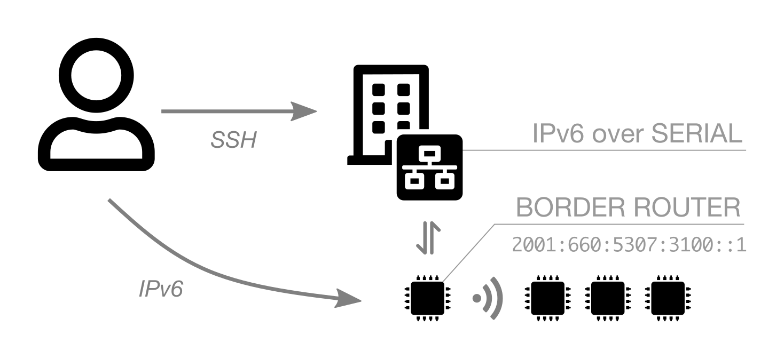

---
jupyter:
  jupytext:
    text_representation:
      extension: .md
      format_name: markdown
      format_version: '1.3'
      jupytext_version: 1.19.3
  kernelspec:
    display_name: Python 3 (ipykernel)
    language: python
    name: python3
---

## Discover IPv6 and 6LoWPAN

In this excercice you will learn how you should communicate with IPV6 and wireless low power devices. The 6LoWPAN protocol has been developed to define the IPv6 adaptation and the way the IP datagrams will be transported over the IEEE802.15.4 radio links. You will deploy a private IPv6 network and test the connectivity between nodes. Moreover you will setup a public IPv6 network with a border router and verify that you can communicate with public servers. Finally with the monitoring feature you will configure a radio sniffer and analyse the traffic. With wireshark, a network protocol analyzer, you will inspect the packets from the different protocols layers with headers and payloads.

### IPv6 overview

Before going into the explanations of network configuration on the nodes, it is essential to have some notions about IPv6. Unlike an IPv4 address which is coded on 32 bits (ie 4 bytes) and uses a decimal notation (for example: 192.168.6.19), an IPv6 address is represented by a series of 128 bits (16 bytes), and is represented with a hexadecimal notation. 

For example, a public IPv6 address (so-called "global" unicast address, that is to say routable) on IoT-LAB Grenoble site can have the full representation:

 `2001:0660:5307:30ff:0000:0000:0000:0001`
 
can be shortened to

 `2001:660:5307:30ff::1` (a series of 0 contiguous is replaced only once by ::)

This 128-bit series is often divided into 2 parts:

* the least significant 64 bits correspond to the address of the host, `::1` in the previous example. Generally, they are constructed from the MAC address of the host to guarantee the uniqueness of an IPv6 address in a subnet (since the physical address isrmally);

* the most significant 64 bits correspond to the network address, `2001:660:5307:30ff::/64` in the previous example. They contain in particular the "prefix" used for routing IPv6 packets and use, as in IPv4, the CIDR notation: &lt;prefix&gt; / &lt;bit length&gt;.  This 64-bit block is divided into a first part containing up to 48 bits and designating the "global routing prefix",  (`2001:660:5307`) the rest of the bits identifying the subnet (`30ff`). A prefix always contains 64 bits.

Some prefixes are reserved for very specific uses:

* `fe80::/10` is used for unicast addresses called "link-local". This type of address only allows 2 network nodes to communicate if they share a direct physical link. This was the case with two nodes with wireless interface (802.15.4),

* `fd00::/8` is intended for "Unique Local Address" addresses. These addresses correspond to private addresses in IPv4 and are not routable.


### Compile the Contiki-NG firmwares

#### IoT-LAB platform support

Since IoT-LAB boards support is not included in the Contiki-NG official repository, set a ARCH_PATH environment variable that points to the additionnal platform support:

```python
%env ARCH_PATH = /home/user/iot-lab-training/contiki-ng/iot-lab-contiki-ng/arch
```

#### Radio settings
If you are running this training as the same time as other people, it is a good idea to change the default radio configuration to avoid too much collision with others.

Use the following cell to give you random values for channel and PAN ID.

```python
import os,binascii,random
pan_id = binascii.b2a_hex(os.urandom(2)).decode()
channel = random.randint(11, 26)
print('Use CHANNEL={}, PAN_ID=0x{}'.format(channel, pan_id))
```

Change default values below before running the cell.


```python
%env RADIO=IEEE802154_CONF_DEFAULT_CHANNEL=26,IEEE802154_CONF_PANID=0xABCD
```

#### Hello-world

This example has IPv6 stack enabled by default.We modified a bit the hello-world example to enable the shell and use the ping command to test the connectivity between two nodes. . Compile the local example. 

```python
!make -C hello-world TARGET=iotlab BOARD=m3 DEFINES=$RADIO
```

#### Border Router

In order for a node to communicate in IPv6 with a host on the global Internet, it needs a “global” unicast address. To do this, a Border Router node must be added to the network, which will be responsible for propagating the IPv6 global prefix to the other nodes. We speak here of border router, because it is on the border between an 802.15.4 network and a classic Ethernet network.

```python
%env APP_DIR = ../../iot-lab-contiki-ng/contiki-ng/examples/rpl-border-router
!make -C $APP_DIR TARGET=iotlab BOARD=m3 DEFINES=$RADIO
```

### Launch an experiment

1. Choose your site (grenoble|lille|saclay|strasbourg):

```python
%env SITE=grenoble
```

2. Submit an experiment with two nodes

```python
!iotlab-experiment submit -d 120 -l 2,archi=m3:at86rf231+site=$SITE
```

3. Wait for the experiment to be in the Running state:

```python
!iotlab-experiment wait --timeout 30 --cancel-on-timeout
```

**Note:** If the command above returns the message `Timeout reached, cancelling experiment <exp_id>`, try to re-submit your experiment later or try on another site.


4. Check the nodes allocated to the experiment

```python
!iotlab-experiment get -ni
```

### Communication between two nodes


You can flash the ``Hello World`` firmware on the two nodes with the following command

```python
!iotlab-node --update hello-world/hello-world.iotlab
```

At this stage open a Jupyter terminal (use `File > New > Terminal`) two times, one for each node, and connect to the IoT-LAB SSH frontend to have access of the node's serial link. 
On the first shell choose one node and connect to the serial port with ``nc`` command (port 20000). Replace ``<site> <id1> with the good values. Next print the shell usage with the ``help`` command and use ``ip-addr`` command to show IPV6 ``link-local`` address.

<!-- #raw -->
ssh $IOTLAB_LOGIN@<site>.iot-lab.info
<!-- #endraw -->

<!-- #raw -->
<login>@<site>:~$ nc m3-<id1> 20000
> help
Available commands:
'> help': Shows this help
'> reboot': Reboot the board by watchdog_reboot()
'> log module level': Sets log level (0--4) for a given module (or "all"). For module "mac", level 4 also enables per-slot logging.
'> mac-addr': Shows the node's MAC address
'> ip-addr': Shows all IPv6 addresses
'> ip-nbr': Shows all IPv6 neighbors
'> ping addr': Pings the IPv6 address 'addr'
'> routes': Shows the route entries
'> rpl-set-root 0/1 [prefix]': Sets node as root (1) or not (0). A /64 prefix can be optionally specified.
'> rpl-local-repair': Triggers a RPL local repair
'> rpl-refresh-routes': Refreshes all routes through a DTSN increment
'> rpl-status': Shows a summary of the current RPL state
'> rpl-nbr': Shows the RPL neighbor table
'> rpl-global-repair': Triggers a RPL global repair
ip-addr
Node IPv6 addresses:
-- fe80::9181
<!-- #endraw -->

On the other node try to ping the IPv6 address and test the connectivity. You can note that we used the IPv6 "link-local" address of the node. We don't have a global IPV6 address and we can only communicate because the two nodes are in the same radio neighborhood with the same physical link (802.15.4 with the same radio channel)

<!-- #raw -->
ssh $IOTLAB_LOGIN@<site>.iot-lab.info
<!-- #endraw -->

<!-- #raw -->
<login>@<site>:~$ nc m3-<id2> 20000
> ping fe80::9181
Pinging fe80::9181
Received ping reply from fe80::9181, len 4, ttl 64, delay 10 ms
<!-- #endraw -->

### Communication via a Border Router (BR)

In order for a node to communicate in IPv6 with a host on the Internet, it needs a “global” unicast address. To do this, a Border Router node  must be added to the network, which will be responsible for propagating the IPv6 global prefix to the other nodes. We speak here of border router, because it is on the border between a 802.15.4 network and a classic Ethernet network. For this choose one node of your experiment to take the role of border router.

<figure>
    
    <figcaption><em>Public IPv6 connectivity on the IoT-LAB platform</em></figcaption>
</figure>

Choose one node of your experiment which will play the role of BR. Replace the ID variable with the good value and flash the firmware only on this node as below


```python
%env ID=1
!iotlab-node --update $APP_DIR/border-router.iotlab -l $SITE,m3,$ID
```

use `File > New > Terminal` and connect to the IoT-LAB SSH frontend to have access of the BR node's serial link.

<!-- #raw -->
ssh $IOTLAB_LOGIN@<site>.iot-lab.info
<!-- #endraw -->

We need to create a network interface and choose a public IPv6 prefix available on the SSH frontend of the site. You can find below the list of available prefix by sites

| Site       | First Prefix        | Last Prefix         | Number of Prefix   |
|------------|---------------------|---------------------|--------------------|
| Grenoble   | 2001:660:5307:3100  | 2001:660:5307:317f  | 128                |
| Lille      | 2001:660:4403:0480  | 2001:660:4403:04ff  | 128                |
| Saclay     | 2001:660:3207:04c0  | 2001:660:3207:04ff  | 64                 |
| Strasbourg | 2a07:2e40:fffe:00e0 | 2a07:2e40:fffe:00ff | 32                 |

As SSH frontend is a shared environment you must check before. Visualize which prefix are already used

<!-- #raw -->
<login>@<site>:~$ ip -6 route
2001:660:5307:3100::/64 dev tun0  proto kernel metric 256  pref medium
2001:660:5307:3102::/64 dev tun1  proto kernel metric 256  pref medium
2001:660:5307:3103::/64 via tun2  proto kernel metric 256  pref medium
2001:660:5307:3104::/64 via tun3  proto kernel metric 256  pref medium
2001:660:5307:3107::/64 via tun4  proto kernel metric 256  pref medium
<!-- #endraw -->

In the example above you can choose the next one which is free on the Grenoble prefix list like 2001:660:5307:3108

Don't forget to close the serial port connection (i.e. nc command) with the BR node.

On the frontend SSH launch the ``tunslip6.py`` command with:
* the good node's ``<id>`` for the border router 
* a virtual network interface IPv6 adrress (i.e. TUN) . This address is of the form ``<ipv6_prefix>::1/64`` with the free prefix you need to choose
For example with the first one of Grenoble site ``<ipv6_prefix>=2001:660:5307:3100``

In the example below we use the m3-10 node

<!-- #raw -->
<login>@<site>:~$ sudo tunslip6.py -v2 -L -a m3-10 -p 20000 2001:660:5307:3100::1/64
Switch from 'root' to 'saintmar'
Calling tunslip:
	'tunslip6 [u'-v2', '-a', 'm3-100', '-L', '-p', '20000', '2001:660:5307:3100::1/64']'
slip connected to ``172.16.10.100:20000''

17:38:27 opened tun device ``/dev/tun0''
0000.001 ifconfig tun0 inet `hostname` mtu 1500 up
0000.009 ifconfig tun0 add 2001:660:5307:3100::1/64
0000.013 ifconfig tun0 add fe80::660:5307:3100:1/64
0000.017 ifconfig tun0

tun0: flags=4305<UP,POINTOPOINT,RUNNING,NOARP,MULTICAST>  mtu 1500
        inet 192.168.1.5  netmask 255.255.255.255  destination 192.168.1.5
        inet6 fe80::20fe:cf3b:331a:7fc6  prefixlen 64  scopeid 0x20<link>
        inet6 fe80::660:5307:3100:1  prefixlen 64  scopeid 0x20<link>
        inet6 2001:660:5307:3100::1  prefixlen 64  scopeid 0x0<global>
        unspec 00-00-00-00-00-00-00-00-00-00-00-00-00-00-00-00  txqueuelen 500  (UNSPEC)
        RX packets 0  bytes 0 (0.0 B)
        RX errors 0  dropped 0  overruns 0  frame 0
        TX packets 0  bytes 0 (0.0 B)
        TX errors 0  dropped 0 overruns 0  carrier 0  collisions 0

0000.777 [INFO: BR        ] Waiting for prefix
0000.777 *** Address:2001:660:5307:3100::1 => 2001:0660:5307:3100
0001.816 [INFO: BR        ] Waiting for prefix
0001.816 [INFO: BR        ] Server IPv6 addresses:
0001.816 [INFO: BR        ]   2001:660:5307:3100::b080
0001.816 [INFO: BR        ]   fe80::b080

<!-- #endraw -->

This runs the program tunslip6, which bridges the Contiki-NG border router node to the SSH frontend server via a TUN interface. Tunslip uses SLIP (Serial Line Internet Protocol) to encapsulate and pass IP traffic to and from the other side of the serial line. The RPL border router, running on the node, has an auto-configured address which you can find out from the above logs. Your host is assigned address ``2001:660:5307:3100::b080``. Make sure to keep this terminal open until the end of the training.

To access nodes inside the RPL network, we first need to find out their global IPv6 address. To help with this, the RPL border router runs an HTTP server. You can request it from the SSH frontend:

<!-- #raw -->
<login>@<site>:~$ lynx -dump http://[2001:660:5307:3100::b080]
   Neighbors
     * fe80::9181

   Routing links
     * 2001:660:5307:3100::9181 (parent: 2001:660:5307:3100::b080) 1020s

<!-- #endraw -->

The page contains a list of routes with the addresses of all nodes in the network.

You can also check that on the other node with the Contiki-NG shell and `ip-addr` command you visualize the global ipv6 address in addition to the ``link-local`` address. Replace `<id2>` with the good value.

<!-- #raw -->
<login>@<site>:~$ nc nc m3-<id2> 20000
ip-addr

Node IPv6 addresses:
-- 2001:660:5307:3100::9181
-- fe80::9181
<!-- #endraw -->

The BR node starts advertising the network via RPL DIO (DODAG Information Object) messages. Nodes that receive a DIO message will join the RPL network. Nodes can also search for available networks by sending periodic DIS (DODAG Information Solicitation) messages. You can find more informations about RPL implementation in the [Contiki-NG documentation](https://github.com/contiki-ng/contiki-ng/wiki/Documentation:-RPL)

The last step is to test the IPv6 connectivity with global internet and the node. Try to ping a public Google server from the shell

<!-- #raw -->
ping 2a00:1450:4007:80f::2003
Pinging 2a00:1450:4007:80f::2003
Received ping reply from 2a00:1450:4007:80f::2003, len 4, ttl 50, delay 100 ms

<!-- #endraw -->

### Radio sniffer

One of the key feature of IoT-LAB is providing automatic monitoring on energy consumption and radio activity, thanks to a Control Node hardware, associated to the experiment node. You do not have to bring a firmware for this Control Node, but just specify its configuration through what we called a 'profile'. Each user can manage his collection of profiles. Here you will create one.

Create a sniffer profile with the good radio channel. Replace CHANNEL variable value with the value obtained at the start.

```python
%env CHANNEL=11
!iotlab-profile addm3 -n sniff_$CHANNEL -sniffer -channels $CHANNEL
```

After you have just to update the monitoring configuration of the node which is not the BR. Replace ID variable with the good value

```python
%env ID=1
!iotlab-node --update-profile sniff_$CHANNEL -l $SITE,m3,$ID
```

Open a third Jupyter Terminal (use `File > New > Terminal`) and connect to the SSH frontend replacing `<site>` with the good value:

<!-- #raw -->
ssh $IOTLAB_LOGIN@<site>.iot-lab.info
<!-- #endraw -->

Launch the sniffer_aggregator command. This command aggregates all the nodes sniffer links (TCP socket on port 30000). By default t it encapsulates packet as ZigBee Encapsulation Protocol (ZEP). With the -r option 802.15.4 payload are extracted and saved in a 802.15.4_link_layer pcap file directly usable in wireshark network traffic analyser. 

<!-- #raw -->
<login>@<site>:~$ sniffer_aggregator -r -d -o - | tshark -V -i - > sniffer.pcap
<!-- #endraw -->

Go to the shell node and ping6 Google server

<!-- #raw -->
ping 2a00:1450:4007:80f::2003
Pinging 2a00:1450:4007:80f::2003
Received ping reply from 2a00:1450:4007:80f::2003, len 4, ttl 50, delay 100 ms

<!-- #endraw -->

On the sniffer aggregator shell you must see that you have captured packets. Stop it with Ctr^C shortcut when you have about ten packets captured. Edit the pcap file and analyse the traffic.


<!-- #raw -->
<login>@<site>:~$ less sniffer.pcap
# use q character shortcut to exit
<!-- #endraw -->

From the frames you can see the IEEE 802.15.4 data, 6LoWPAN and Internet Protocol version 6 layer.

* In the 802.15.4 section you can see the mac address of the source and destination packet. You can retrieve the mac address of your node which executes the ping6 address in the Src field.

* In the 6LoWPAN section you can see the IPV6 address of the source and destination packet.

* In the IPv6 section you can see the ICMP message which corresponds to a Echo ping request (ping6 command)

From the other frames you should see the ICMP message from the Google server which corresponds to Echo ping reply and you can discover the DODAG Information Solicitation traffic between the border router and the node.


### Free up the resources

Since you finished the training, stop your experiment to free up the experiment nodes:

```python
!iotlab-experiment stop
```

The serial link connection through SSH and the tunslip6 process will be closed automatically.
