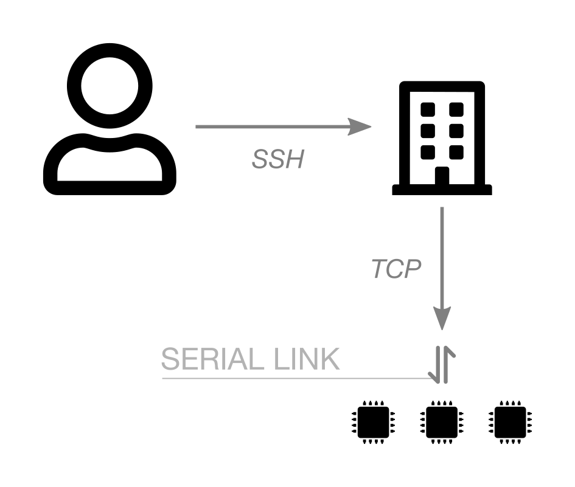

---
jupyter:
  jupytext:
    text_representation:
      extension: .md
      format_name: markdown
      format_version: '1.3'
      jupytext_version: 1.19.3
  kernelspec:
    display_name: Python 3 (ipykernel)
    language: python
    name: python3
---

<!-- #region -->
## Flash a prebuilt firmware on IoT-LAB


It's time to start working with the IoT-LAB testbed! In this hands-on activity you will launch your first experiment with CLI-tools. For this you will book a node and flash on it a binary firmware provided by us. You will discover how you can directly interact with the node during the experiment with its serial port which is forwarded by a TCP socket on the SSH frontend. In this way you can access the firmware shell and run commands such as reading temperature sensor values. For all the next activities you will repeat these steps of submitting experiment and booking nodes and it's important to understand them well. Of course you will also learn later on how to write your own firmware with an embedded OS and flash it on the nodes.

<figure>
    
    <figcaption><em>Node serial-link access</em></figcaption>
</figure>

### Submit an experiment on the IoT-LAB

1. Choose your site (grenoble|lille|strasbourg):
<!-- #endregion -->

```python
%env SITE=grenoble
```

2. Submit an experiment using the following command:

```python
!iotlab-experiment submit -n "flash" -d 20 -l 1,archi=m3:at86rf231+site=$SITE,tutorial_m3.elf
```

if the experiment submission success you must get a testbed answer with the experiment unique id.

The `-l` option is used to specify resources needed and firmware association. Here you specified resources by their characteristics (number, type of node (_archi_) and site) but it is  also possible to specify resources by their IDs. Read the command help to have an overview of options, syntax and some examples.

```python
!iotlab-experiment submit -h
```

3. Wait for the experiment to be in the Running state:

```python
!iotlab-experiment wait --timeout 30 --cancel-on-timeout
```

**Note:** If the command above returns the message `Timeout reached, cancelling experiment <exp_id>`, try to re-submit your experiment later or try on another site.


4. Get the experiment nodes list:

```python
!iotlab-experiment --jmespath="items[*].network_address | sort(@)" get --nodes
```

<!-- #region -->
**Be careful**, you must note the id of the booked node because it will be useful when you read its serial port. Each node is listed using its network address, which is of the form `m3-<id>.<site>.iot-lab.info`. You have to remember the `m3-<id>` string for the netcat command on the SSH frontend. 


### Open a serial console and read the output of the firmware

The serial port of each device used in an experiment is reachable via a TCP socket exposed on the site server.

1. Open a JupyterLab Terminal (File > New > Terminal) and connect to the SSH frontend server. Replace `<site>` with the right value.
<!-- #endregion -->

<!-- #raw -->
ssh $IOTLAB_LOGIN@<site>.iot-lab.info
<!-- #endraw -->

2. From there, use the `nc` (or 'netcat') utility to connect to this socket (host is node's network address, port is 20000):

<!-- #raw -->
<login>@<site>:~$ nc m3-<id> 20000
<!-- #endraw -->

3. Type 'h' and Enter to display the help. Then, type another command to test the firmware features.


### Free up the resources

Since you finished the training, stop your experiment to free up the experiment nodes:

```python
!iotlab-experiment stop
```

The serial link connection through SSH will be closed automatically.
