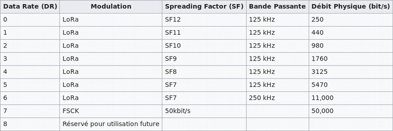
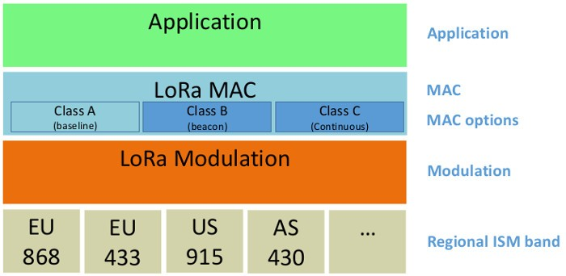
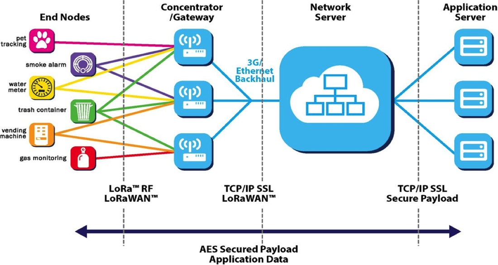
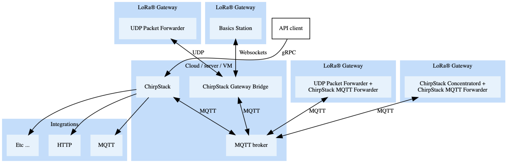
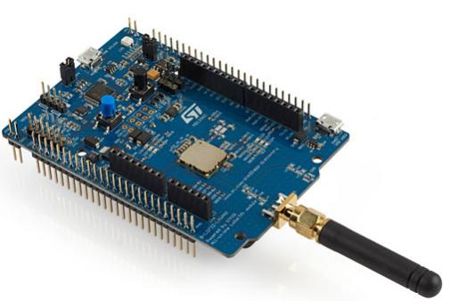
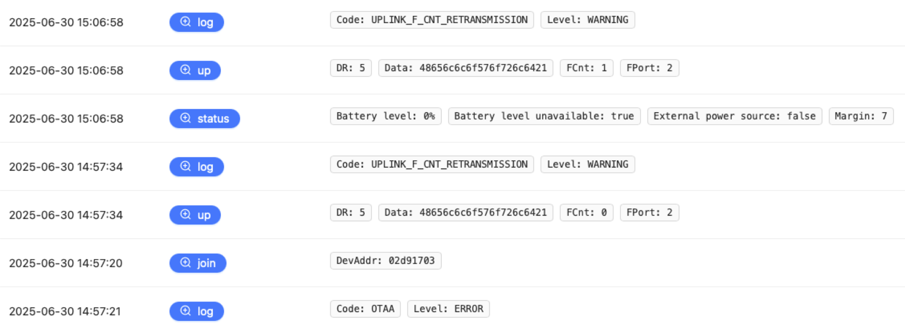
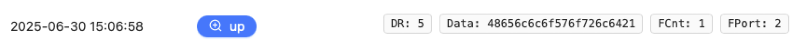
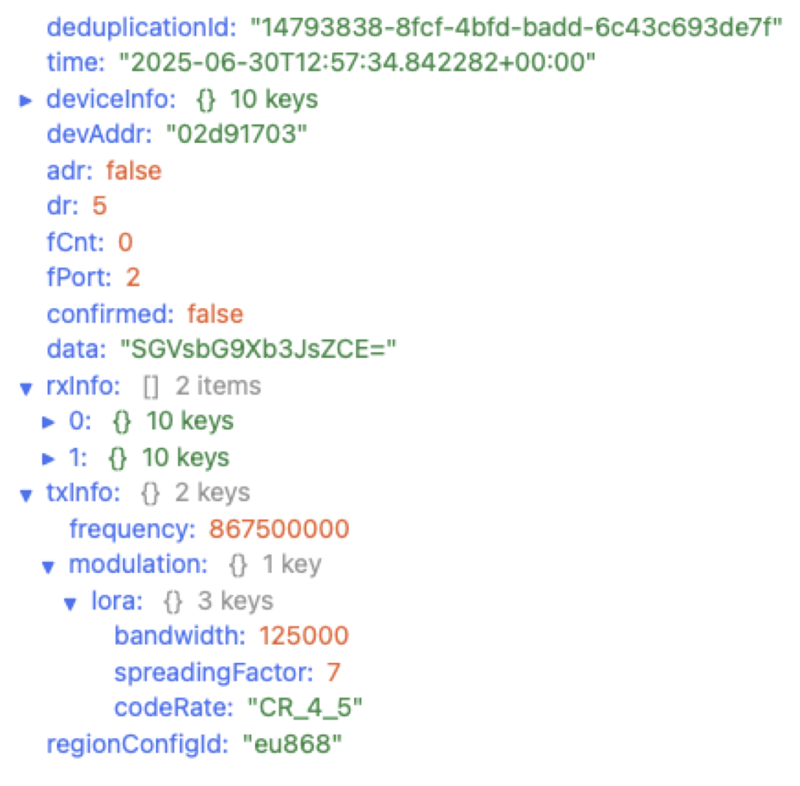

---
jupyter:
  jupytext:
    text_representation:
      extension: .md
      format_name: markdown
      format_version: '1.3'
      jupytext_version: 1.19.3
  kernelspec:
    display_name: Python 3 (ipykernel)
    language: python
    name: python3
---

## Getting started with LoRaWAN on IoT-LAB using RIOT

The goal of this notebook is to discover the basics of LoRaWAN communication using RIOT on IoT-LAB and the ChirpStack LoRaWAN Network Server.

> We recommend that you follow the [LoRa boards](../lora-boards/lora-boards.md) notebook if not done already.

This Notebook is divided in several steps:
1. The first step requires you to configure a LoRaWAN application with one device on the Chirpstack backend
2. Then you will submit an experiment with one ST B-L072Z-LRWAN1 node (known as st-lrwan1) on the Saclay site
3. Once the experiment is running, you will build and flash a RIOT application that provides a shell to control the LoRaWAN stack. On the board, you will configure the identifiers and keys required for Over-The-Air Activation (OTAA).
4. In the last step of this tutorial, you will exchange messages between the board and the Chirpstack Network server.

### LoRaWAN overview

A LoRaWAN network includes a set of subsystems and protocols allowing _end-devices_ to communicate on long distances while consuming little energy.

To communicate by radio, LoRaWAN devices and gateways use the LoRa radio technology. This technology is based on a Chirp Spreading Spectrum frequency modulation within public radio frequency bands (ISM). The access to the physical layer is regulated and depends on the region of use.

For example, LoRaWAN defines the notion of "datarate". A datarate index is the combination of a spreading factor (SF) and a bandwidth (BW), as shown in the table below:

<figure style="text-align:center">
    <br/><br/>
    <figcaption><em>LoRaWAN Datarate table for EU868 band</em></figcaption>
</figure>

A datarate of 0 uses a spreading factor of 12 and a bandwidth of 125kHz, in this case the transmission is the slowest (250 bit/s). A datarate of 6 uses a spreading factor of 7 and a bandwidth of 250kHz, the transmission is the fastest in this case (11kbit/s).

You can find more information on LoRaWAN [here](https://fr.wikipedia.org/wiki/LoRaWAN) and [here](https://docs.wixstatic.com/ugd/eccc1a_20fe760334f84a9788c5b11820281bd0.pdf):

On IoT-LAB, the EU868 ISM band is used by the boards, because they are all located in Europe and the boards can only transmit on this band.

<figure style="text-align:center">
    <br/><br/>
    <figcaption><em>The LoRaWAN stack</em></figcaption>
</figure>

The LoRaWAN specifications define 3 classes of end-devices: A, B, C. Each of which has specific access to the physical layer. For more details, please refer to the LoRa specifications provided by the LoRa Alliance [here](https://www.lora-alliance.org/lorawan-for-developers).

Here is a global overview of a LoRaWAN network:

<figure style="text-align:center">
    <br/><br/>
    <figcaption><em>The LoRaWAN infrastructure</em></figcaption>
</figure>

End devices use LoRa modulation to communicate with the gateways, which themselves use the regular Internet protocols to communicate with the LoRaWAN server, owned by a provider.

### ChirpStack overview

ChirpStack is an open-source LoRaWAN network which can be used to setup private or public LoRaWAN networks

<figure style="text-align:center">
    <br/><br/>
    <figcaption><em>ChirpStack functional architecture</em></figcaption>
</figure>

- ChirpStack provides a web-interface for the management of gateways, devices and tenants oriented towards open access to IoT networks
- ChirpStack server is free of charge, without restriction
- Interaction with other external applications for handling device data (cloud providers, databases)

A ChirpStack lite gateway is installed in the IoT-LAB Saclay site and connected to the ChirpStack server. Thus, this allows LoRa devices deployed in the Saclay site to communicate with the ChirpStack backend. You can configure a ChirpStack profile following the instructions available **[here](./chirpstack-getting-started/chirpstack-tutorial.md)**.


> **Important:** In the following instructions of this tutorial, we consider that your application name is **_iotlab-lorawan_** and your node id is **_iotlab-node_**. 
>
> **Replace these names with the information you configured in your own ChirpStack account and application**.

### Start an experiment with one LoRa device

Now let's book one the LoRa device available in the IoT-LAB testbed. The boards are [ST B-L072Z-LRWAN1](https://www.st.com/en/evaluation-tools/b-l072z-lrwan1.html):

<figure style="text-align:center">
    <br/><br/>
    <figcaption><em>The ST B-L072Z-LRWAN1 board used in IoT-LAB</em></figcaption>
</figure>

1. Submit an experiment with one LoRa device on IoT-LAB:

```python
!iotlab-experiment submit -n "chirpstack-getting-started" -d 120 -l 1,archi=st-lrwan1:sx1276+site=saclay
```

2. Wait for the experiment to be in the "Running" state:

```python
!iotlab-experiment wait --timeout 30 --cancel-on-timeout
```

> **Note:** If the command above returns the message `Timeout reached, cancelling experiment <exp_id>`, try to re-submit your experiment later.

### Build and flash the RIOT firmware

To use the ST board with the ChirpStack LoRaWAN network, you must first flash the RIOT LoRaWAN test application, `tests/pkg_semtech-loramac`:

1. Build and flash the `tests/pkg_semtech-loramac` application of RIOT.

This application provides a shell to finely control the loramac stack on the device. By default, the target of the application corresponds to the [st-lrwan1 board](https://www.iot-lab.info/docs/boards/st-b-l072z-lrwan1/) in IoT-LAB.

```python
!make IOTLAB_NODE=auto -C ../../RIOT/tests/pkg_semtech-loramac flash
```

To communicate in LoRaWAN, this application relies on a library (a "package") developed by Semtech and [available on GitHub](https://github.com/Lora-net/LoRaMac-node). As of today, this library is the reference implementation of the MAC layer of the LoRaWAN protocol for end-devices.

2. Open a terminal: `File > New > Terminal` and connect to the shell by running the following command in the terminal:

<!-- #raw -->
make IOTLAB_NODE=auto -C riot/RIOT/tests/pkg_semtech-loramac term
<!-- #endraw -->

You can press *Enter* to get the `>` prompt.

You are now ready for configuring your LoRaWAN device!

### Configure the LoRaWAN device

Before going through the next actions, open your [ChirpStack console](https://services.iot-lab.info/#/) in a browser and go to your device **Overview** page. This page contains the information required to configure your device in the next steps.

The RIOT shell provides the `loramac` command to control the loramac stack, join the network, and send packets:

<!-- #raw -->
> loramac
loramac
Usage: loramac <get|set|join|tx|link_check|save|erase>
<!-- #endraw -->

1. In the RIOT shell, let's start by configuring the loramac stack with your DEVEUI, APPEUI and APPKEY (use the information of the device Overview tab and the copy to clipboard button to make things simpler):

<!-- #raw -->
> loramac set appeui 00000000000000
> loramac set deveui 00000000000000
> loramac set appkey 0000000000000000000000000000
<!-- #endraw -->

 >**note:** Use the values of your registered device from the TheThingsStack backend.

2. Configure a fast datarate, e.g. 5, corresponding to a bandwidth of 125kHz and a spreading factor of 7, since the nodes are very close to the gateway:

<!-- #raw -->
> loramac set dr 5
<!-- #endraw -->

3. Now that the device is correctly configured for OTAA activation, it is time to join it to the network:

<!-- #raw -->
> loramac join otaa
Join procedure succeeded!
<!-- #endraw -->

> **Reminder:** The principle of OTAA activation is to use the identifiers of the device (Device EUI) and the application (Application EUI) with the application key to build a secure connection request.
> Upon receipt of this connection request, the LoRaWAN server checks that the message is valid, using the Message Integrity Code (MIC), and it verifies the validity of the identifiers.
> If the request is valid, the server responds with an acknowledgement message containing a "nonce" (an arbitrary number) that will be used by the server and by the device to determine the session keys (network and application) from the initial application key.

On the ChirpStack web console, go to the **Data** tab of the `iotlab-node` page. You should see the activation message received by the ChirpStack backend (the item is clickable).

4. Now use the `tx` subcommand with the `uncnf` option to send an unconfirmed payload (no ACK expected from the server) to the backend: 

<!-- #raw -->
> loramac tx HelloWorld! uncnf
Message sent with success
<!-- #endraw -->

Still in the **Events** tab of the `iotlab-node` web page, you should see the message received by the ChirpStack LoRaWAN server:

<figure style="text-align:center">
    <br/><br/>
    <figcaption><em>Messages received on ChirpStack</em></figcaption>
</figure>

In the event output, payloads are encoded in hexadecimal values: one ascii byte => 2 hexadecimal characters and they are cropped so it's not possible to get the full content of the message this way:

<figure style="text-align:center">
    <br/><br/>
    <figcaption><em>Uplink message received by the server</em></figcaption>
</figure>

If you click on the uplink message line, the event details appears on the right. Scroll in the `Details` area and check the `data` field. This field contains the message sent, encoded in **base64**:

<figure style="text-align:center">
    <br/><br/>
    <figcaption><em>Uplink message event details</em></figcaption>
</figure>

We can decode the content of the payload received by the server using the command `base64` as shown below:

```python
!base64 -d <<< SGVsbG9Xb3JsZCE=
```

5. Send a downlink message from the **Messaging** tab of the `iotlab-node` device (for example use the following hexadecimal values: **48656C6C6F52494F5421**)

> **Note**: If the downlink is forbidden with a message saying that the device is not activated, just refresh the page.

> **Note**: Nothing is received by the node because a LoRaWAN class A device (the default for a RIOT LoRaWAN node) only have a short RX window after a send.

In order to receive the downlink message, just send another message to ChirpStack: 

<!-- #raw -->
> loramac tx HelloWorld! uncnf
Data received: HelloRIOT!, port: 1
Message sent with success
<!-- #endraw -->

You sent and received LoRaWAN messages using RIOT on IoT-LAB, congratulations !

### Free up the resources

Since you finished the training, stop your experiment to free up the experiment nodes:

```python
!iotlab-experiment stop
```

The serial link connection through SSH will be closed automatically.
