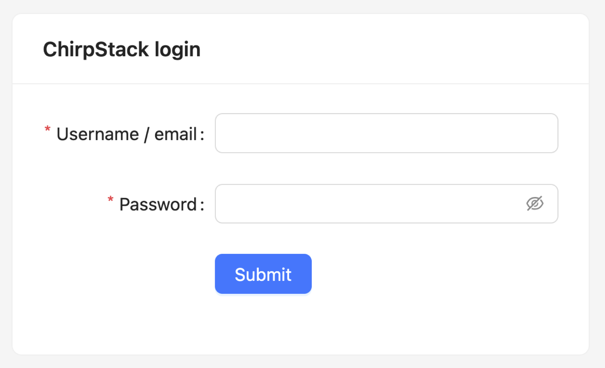

---
jupyter:
  jupytext:
    text_representation:
      extension: .md
      format_name: markdown
      format_version: '1.3'
      jupytext_version: 1.19.3
---

# Configure a ChirpStack application

Before using the LoRa devices in IoT-LAB, you have to create an account and register an application with a device configured on ChirpStack.

1. You can access the ChirpStack application with the same IoT-LAB credentials [here](https://lns4.iot-lab.info/#/login)

<figure style="text-align:center">
    <br/><br/>
    <figcaption><em>ChirpStack IoT-LAB signup interface</em></figcaption>
</figure>


# Device profile

A Device profile is a blueprint that tells ChirpStack what kind of device you're working with, how it communicates, and how the server should interpret and manage its data.

Device profile parameters:

- Communication parameters: Sets MAC version, frequencies, RX windows;
- Class behavior: Configures Class A/B/C support;
- Payload decoding/encoding logic;
- Device's registration: Manages join parameters (OTAA or ABP) and timing.

Follow the Device profile configuration in the next step-by-step video:

```python vscode={"languageId": "plaintext"}
from IPython.display import Video
Video("images/Video1-0.5x.mp4", embed=True, width=500)
```

# Application

Each end-device of a LoRaWAN network is part of a LoRaWAN application. You have to configure a first application to allow you to communicate with your device over LoRa.

An Application is the logical grouping of devices and their data streams. It plays a key organizational and functional role in how data flows from devices to your integrations.

Application deals with:

- Grouping devices logically by device profiles;
- Controling data routing via integrations per application;
- Payload Decoding and Transformation and formats;
- Security and API tokens.

Once you have create a **Device profile** and an **Application**, it is possible to register a **Device**. Keep the default Other-The-Air Activation (OTAA) procedure.The OTAA activation requires these parameters:
   - **LoRaWAN version**: choose **MAC V1.0.3**
   - **Frequency plan**: Choose Europe 863-870 MHz (SF9 for RX2 - recommended)
   - **Device EUI**: the device unique identifier is a 8 bytes array (16 hex char string). Generate a random one using the web interface.
   - **Join EUI**: the application unique identifier is a 8 bytes array (16 hex char string). Fill it with zeros or generate a random one.

After you submit the configuration, you can generate AppKey:
   - **Application Key**: the application key is a 16 bytes array (32 hex char string). Generate a random one using the web interface.

Follow the Application configuration in the next step-by-step video:

```python vscode={"languageId": "plaintext"}
Video("images/Video2-0.5x.mp4", embed=True, width=500)
```

Finally, you will have a device link to a device profile/application and you will see the Dashboard available for this device, as shown in the next video.

```python vscode={"languageId": "plaintext"}
Video("images/Video3-0.5x.mp4", embed=True, width=500)
```
