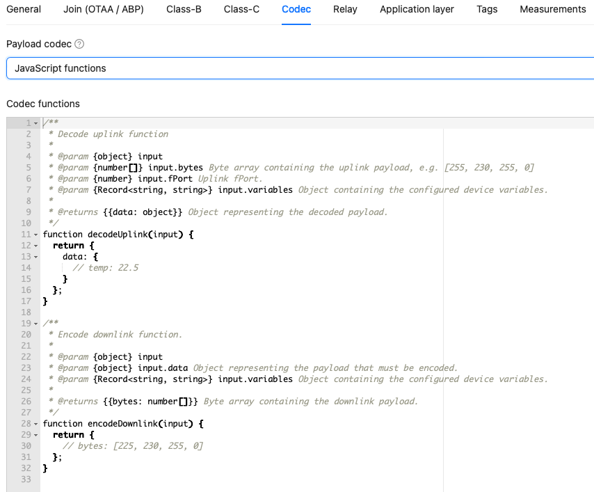
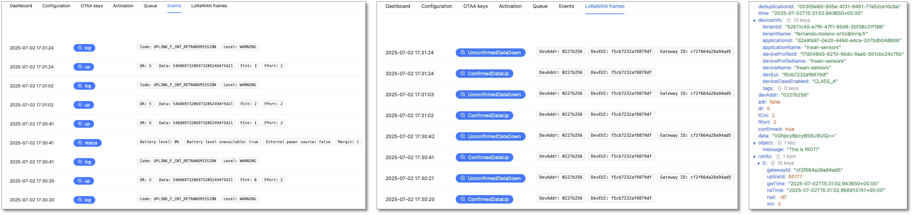
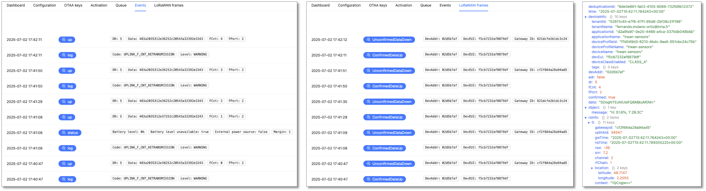

---
jupyter:
  jupytext:
    text_representation:
      extension: .md
      format_name: markdown
      format_version: '1.3'
      jupytext_version: 1.19.3
  kernelspec:
    display_name: Python 3 (ipykernel)
    language: python
    name: python3
---

<!-- #region -->
## Autonomously send real sensor values to ChirpStack

**Prerequisites:** You must have followed the [getting started with ChirpStack notebook](../chirpstack-getting-started/chirpstack-getting-started.md) before starting this one.

> We also consider that the application id is **iotlab-lorawan** and the device id is **iotlab-node** but you'll have to use the ids corresponding to your application and device configured in ChirpStack.

In this notebook, you will write an autonomous LoRaWAN application with the following specifications:
- The application automatically connects to ChirpStack at startup using the OTAA activation and a datarate index of 5
- In case of an activation issue, an error message is printed to the console and the application returns
- A message is printed to the console to confirm the success of the activation
- A message is sent periodically (check the duty cycle!) to the ChirpStack LoRaWAN server. This message will first contain a basic string and in a second phase, it will contain the values measured on the temperature and humidity sensors.
- A message is printed to the console each time the message is sent with success.

We provide a starting RIOT application with a [Makefile](Makefile) and a [main.c](./main.c). The [Makefile](Makefile) is already configured but you will have to edit the [main.c](./main.c) by following the instructions of this Notebook.

### Configure the ChirpStack payload format

Before we start coding the application, we need to change how the data is displayed in the **Events** tab of your ChirpStack application.

You can change this format of the payload used to display the content of an uplink message in the `Device Profile/<name-profile>/Codec` tab:

<figure style="text-align:center">
    <br/><br/>
    <figcaption><em>Application `Payload formatters` tab in the ChirpStack console</em></figcaption>
</figure>

1. Select `Javascript` in the drop down button.
2. Copy the following code snippet in the `decoder` text edit:

```js
function decodeUplink(input) {
var message = "";

for  (var i=0; i < input.bytes.length; i++) {
    message += String.fromCharCode(input.bytes[i]);
}

var humidity_var = message.match(/H:\s*([\d.]+)%/);
var temp_var = message.match(/T:\s*([\d.]+)C/);

return {
    data: {
      humidity: humidity_var ? parseFloat(humidity_var[1]) : null,
      temperature: temp_var ? parseFloat(temp_var[1]) : null
    },
    warnings: [],
    errors: []
  };
}
```
3. Click on the `Save changes` button at the end of the page

### Implement an autonomous RIOT application

The LoRaWAN API of RIOT is documented online at http://doc.riot-os.org/group__pkg__semtech-loramac.html.

Let's edit the [main.c](./main.c).

1. Add the necessary includes for the sx127x radio driver under the comment `/* Add sx127x radio driver necessary includes here */`:

```c
#include "sx127x.h"
#include "sx127x_netdev.h"
#include "sx127x_params.h"
```

2. Add the necessary includes for the loramac stack under the comment `/* Add loramac necessary includes here */`:


```c
#include "net/loramac.h"     /* core loramac definitions */
#include "semtech_loramac.h" /* package API */
```


3. Declare the global descriptor for the sx127x radio driver:

```c
static sx127x_t sx127x;      /* The sx127x radio driver descriptor */
```


4. Declare the global descriptor for the loramac stack:


```c
static semtech_loramac_t loramac;  /* The loramac stack descriptor */
```


5. Configure the identifiers (application and device) and the application key. You can find them in the device overview on ChirpStack.


```c
static const uint8_t appeui[LORAMAC_APPEUI_LEN] = { 0x00, 0x00, 0x00, 0x00, 0x00, 0x00, 0x00, 0x00 };
static const uint8_t deveui[LORAMAC_DEVEUI_LEN] = { 0x00, 0x00, 0x00, 0x00, 0x00, 0x00, 0x00, 0x00 };
static const uint8_t appkey[LORAMAC_APPKEY_LEN] = { 0x00, 0x00, 0x00, 0x00, 0x00, 0x00, 0x00, 0x00, 0x00, 0x00, 0x00, 0x00, 0x00, 0x00, 0x00, 0x00 };
```

**note:** in the device overview on ChirpStack, it's possible to switch the representation of the EUIs and key from an hexadecimal representation (the default) to a C byte array representation (the one that interests us here): use the `<>` button to switch from one to the other and keep the MSB order.

5. At the beginning of the main function, initialize the radio driver:

```c
    sx127x_setup(&sx127x, &sx127x_params[0], 0);
    loramac.netdev = &sx127x.netdev;
    loramac.netdev->driver = &sx127x_driver;
```

6. At the beginning of the main function, initialize the loramac stack:

```c
    semtech_loramac_init(&loramac);
```

7. Then, configure the keys:

```c
    semtech_loramac_set_deveui(&loramac, deveui);
    semtech_loramac_set_appeui(&loramac, appeui);
    semtech_loramac_set_appkey(&loramac, appkey);
```

8. All devices are very close to the gateway in IoT-LAB, so we can configure a fast datarate. Let's use DR5:

```c
    semtech_loramac_set_dr(&loramac, 5);
```

9. Add the logic to join the network using the OTAA activation:

```c
    if (semtech_loramac_join(&loramac, LORAMAC_JOIN_OTAA) != SEMTECH_LORAMAC_JOIN_SUCCEEDED) {
        puts("Join procedure failed");
        return 1;
    }
    puts("Join procedure succeeded");
```

10. Finally, in the `while` loop (under the comment `/* send the message here */`), send the message or continue if the message couldn't be sent:

```c
        if (semtech_loramac_send(&loramac,
                                 (uint8_t *)message, strlen(message)) != SEMTECH_LORAMAC_TX_DONE) {
            printf("Cannot send message '%s'\n", message);
        }
        else {
            printf("Message '%s' sent\n", message);
        }
```

11. Save the changes in main.c using the `Ctrl + s` keyboard shortcut and then verify that the application builds correctly:
<!-- #endregion -->

```python
!make
```

### Start an experiment on IoT-LAB

Now that we have a ready application, we can try it on the real hardware provided remotely by IoT-LAB.

1. Submit an experiment with one LoRa device on IoT-LAB:

```python
!iotlab-experiment submit -n "chirpstack-sensors" -d 120 -l 1,archi=st-lrwan1:sx1276+site=saclay
```

2. Wait for the experiment to be in the "Running" state:

```python
!iotlab-experiment wait --timeout 30 --cancel-on-timeout
```

**Note:** If the command above returns the message `Timeout reached, cancelling experiment <exp_id>`, try to re-submit your experiment later.

3. Open a new terminal with the menu `File > New > Terminal` and in the terminal, run the following command to connect to the serial link of the LoRa board:

<!-- #raw -->
make IOTLAB_NODE=auto -C riot/lorawan/chirpstack-sensors term
<!-- #endraw -->

**It is normal if nothing is printed: there's normally no firmware running on the board. The firmware will be flashed during the next step**

**Keep this command running until the end of this notebook.**


4. Build and flash the application on the LoRa board:

```python
!make IOTLAB_NODE=auto flash-only
```

<!-- #region -->
Once the flashing is complete, in the terminal, you should see the messages corresponding to the join procedure ("Join procedure succeeed") and the messages sent every 20s.

If the device cannot join, verify the configured EUIs and the application key.

If everything works as expected, you should see the decoded "This is RIOT!" messages appear in the **Events** tab of your application:


<figure style="text-align:center">
    <br/><br/>
    <figcaption><em>Decoded messages received in the ChirpStack console</em></figcaption>
</figure>

### Read the sensor values

Let's add the final step: read some sensor values from the [X-Nucleo extension shield](https://www.st.com/en/ecosystems/x-nucleo-iks01a2.html).

The X-Nucleo extension shield provides several ST Microelectronics sensors including the **HTS221** which measures temperature and humidity. The microcontroller interacts with this sensor using the [I2C serial bus](https://en.wikipedia.org/wiki/I%C2%B2C).

Let's now edit the [Makefile](Makefile) and [main.c](main.c) to read this sensor.

1. To be able to use the _hts221_ sensor with RIOT, you must first load the corresponding RIOT module in the application's [Makefile](Makefile). Add the following line to the Makefile (under the addition of the `ztimer_msec` module):


```mk
USEMODULE += hts221
```

All dependency modules required by the sensor driver will be loaded automatically during compilation, in particular the I2C bus driver used by the board to communicate with the sensor.

2. In the [main.c](main.c) file, Add the necessary header inclusions first (just below `#includes "semtech_loramac.h"`):


```c
#include "hts221.h"
#include "hts221_params.h"
```


3. Declare the variable containing the driver descriptor of the sensor (below the declaration of the `loramac` variable):

```c
static hts221_t hts221;
```

4. At the very beginning of the `main` function, add this sensor driver initialization sequence:

```c
    if (hts221_init(&hts221, &hts221_params[0]) != HTS221_OK) {
        puts("Sensor initialization failed");
        return 1;
    }

    if (hts221_power_on(&hts221) != HTS221_OK) {
        puts("Sensor initialization power on failed");
        return 1;
    }

    if (hts221_set_rate(&hts221, hts221.p.rate) != HTS221_OK) {
        puts("Sensor continuous mode setup failed");
        return 1;
    }
```

This sequence is adapted from the [hts221 test appplication](https://github.com/RIOT-OS/RIOT/blob/master/tests/driver_hts221/main.c#L34-L45).

5. Finally, add the following code at the beginning of the `while` loop to read the sensor data. You can also delete the line `char *message = "This is RIOT!"`
which is now useless:

```c
        /* do some measurements */
        uint16_t humidity = 0;
        int16_t temperature = 0;
        if (hts221_read_humidity(&hts221, &humidity) != HTS221_OK) {
            puts("Cannot read humidity!");
        }
        if (hts221_read_temperature(&hts221, &temperature) != HTS221_OK) {
            puts("Cannot read temperature!");
        }

        char message[64];
        sprintf(message, "H: %d.%d%%, T:%d.%dC",
                (humidity / 10), (humidity % 10),
                (temperature / 10), (temperature % 10));
        printf("Sending message '%s'\n", message);
```

6. Build and flash the new application to the LoRa board of your experiment:
<!-- #endregion -->

```python
!make IOTLAB_NODE=auto flash
```

Now you can switch back to the terminal that is connected to the serial port of the LoRa board: **a new join procedure should be performed and the sensor data are sent every 20s to chirpstack**.

<figure style="text-align:center">
    <br/><br/>
    <figcaption><em>Sensor data received in the ChirpStack console</em></figcaption>
</figure>


```python
!base64 -d <<< SDogNTEuNiUsIFQ6MjkuM0M=
```

### Free up the resources

Since you finished the training, stop your experiment to free up the experiment nodes:

```python
!iotlab-experiment stop
```

The serial link connection through SSH will be closed automatically.
