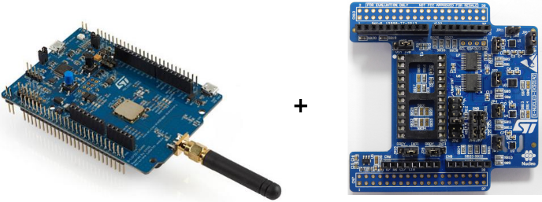

---
jupyter:
  jupytext:
    text_representation:
      extension: .md
      format_name: markdown
      format_version: '1.3'
      jupytext_version: 1.19.3
  kernelspec:
    display_name: Python 3 (ipykernel)
    language: python
    name: python3
---

## Getting started with LoRa boards

The LoRa boards available on the IoT-LAB testbed are ST Microelectronics boards [B-L072Z-LRWAN1](http://www.st.com/en/evaluation-tools/b-l072z-lrwan1.html).
These boards are equipped with a 32 bit ARM STM32 L0 microcontroller (20kB of RAM, 192kB of flash memory) and a Semtech SX1276 radio.
You can find more details about this board in the [datasheet](http://www.st.com/resource/en/user_manual/dm00329995.pdf).

In IoT-LAB, on each board is also plugged an ST Microelectronics [X-Nucleo extension shield](http://www.st.com/en/ecosystems/x-nucleo-iks01a2.html) which provides several sensors: temperature, relative humidity level, atmospheric pressure, accelerometer.

For more details on this extension shield, you have a look at the [datasheet](http://www.st.com/resource/en/user_manual/dm00333132.pdf).

<figure style="text-align:center">
    <br/><br/>
    <figcaption><em>The ST B-L072Z-LRWAN1 board with extension shield used in IoT-LAB</em></figcaption>
</figure>

In this notebook, you will perform remote basic interactions on the LoRa boards hosted in the IoT-LAB testbed:
1. build and flash a firmware
2. interact with the shell
3. reset the firmware

### Start an experiment on IoT-LAB

1. Book a LoRa board by launching a 2-hour experiment:

```python
!iotlab-experiment submit -n "lora-boards" -d 120 -l 1,site=saclay+archi=st-lrwan1:sx1276
```

2. Wait for the experiment to be in the "Running" state:

```python
!iotlab-experiment wait --timeout 30 --cancel-on-timeout
```

**Note:** If the command above returns the message `Timeout reached, cancelling experiment <exp_id>`, try to re-submit your experiment later or try on another site.

4. Check the board of your experiment:

```python
!iotlab-experiment --jmespath="items[*].network_address | sort(@)" get --nodes
```

### Build and flash a firmware on the board

Let's start with the usual `hello_world` sample application provided by the RIOT source code.

```python
!make BOARD=b-l072z-lrwan1 IOTLAB_NODE=auto -C ../../RIOT/examples/basic/hello-world flash
```

<!-- #region -->
The `flash` target automatically calls the appropriate programming tool to the given board. And here, since we are remotely flashing on IoT-LAB, the `iotlab-node` from the [IoT-LAB CLI tools](https://github.com/iot-lab/cli-tools) project is used.


If everything went well, no error message should be displayed and the `iotlab-node` should return `0`.
<!-- #endregion -->

### Interact with the shell

Now that we know that we can remotely flash the board from Jupyerlab, let's verify that we can interact with a shell running on the board.

We will build and flash the [examples/default](https://github.com/RIOT-OS/RIOT/tree/master/examples/default) application of RIOT because it provides a shell and a few commands.

1. First build and flash the application:

```python
!make BOARD=b-l072z-lrwan1 IOTLAB_NODE=auto -C ../../RIOT/examples/basic/default flash
```

2. Open a terminal: `File > New > Terminal` and connect to the shell using the following command:

<!-- #raw -->
make BOARD=b-l072z-lrwan1 IOTLAB_NODE=auto -C riot/RIOT/examples/basic/default term
<!-- #endraw -->

Press `Enter` in the terminal and the shell should respond with the prompt character `>`.

Once the serial terminal is connected to the board, you can communicate directly with the program running on the microcontroller.

Here we have "flashed" a program with a "shell", which means that we can send him commands that the program will interpret and execute.

**Note:** In raw cells, we use `> command` when the command `command` correspond to a command that must be run in the RIOT shell.

3. Check the commands available in the RIOT shell of this application using the `help` command:

<!-- #raw -->
> help
help
Command              Description
---------------------------------------
reboot               Reboot the node
ps                   Prints information about running threads.
rtc                  control RTC peripheral interface
ifconfig             Configure network interfaces
txtsnd               Sends a custom string as is over the link layer
saul                 interact with sensors and actuators using SAUL
<!-- #endraw -->

4. Verify that the LoRa radio is correctly configured using the `ifconfig` command:

<!-- #raw -->
> ifconfig
ifconfig
Iface  4  Frequency: 868299987Hz  BW: 125kHz  SF: 12  CR: 4/8 
           TX-Power: 14dBm  State: SLEEP 
          L2-PDU:255 
<!-- #endraw -->

By default, the radio is configured with a 125kHz bandwidth and a spreading factor of 12.


### Reset the board

On IoT-LAB, you can also remotely reset a board by the using the `reset` target with `make`. This can be useful in case of the crash of the application to restart it in a stable configuration:

```python
!make BOARD=b-l072z-lrwan1 IOTLAB_NODE=auto -C ../../RIOT/examples/basic/default reset
```

Check the terminal where you played with the shell, the application has rebooted.


### Free up the resources

Since you finished the training, stop your experiment to free up the experiment nodes:

```python
!iotlab-experiment stop
```

The serial link connection through SSH will be closed automatically.
