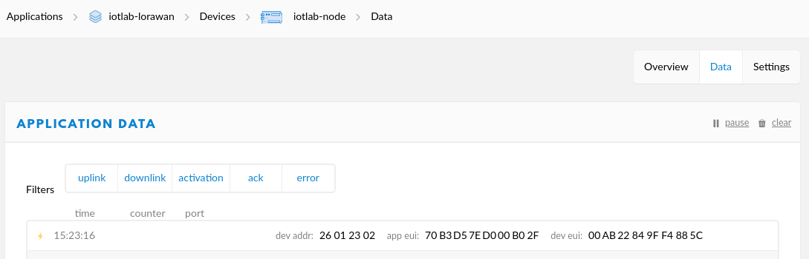
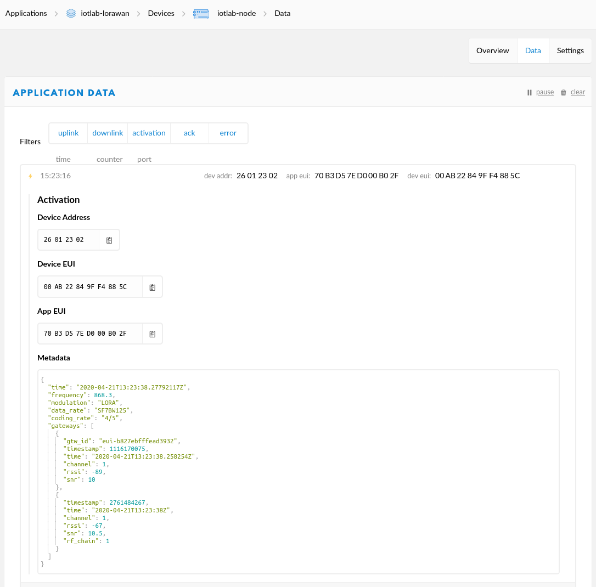
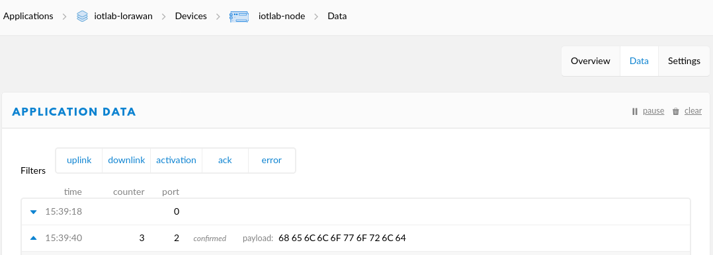
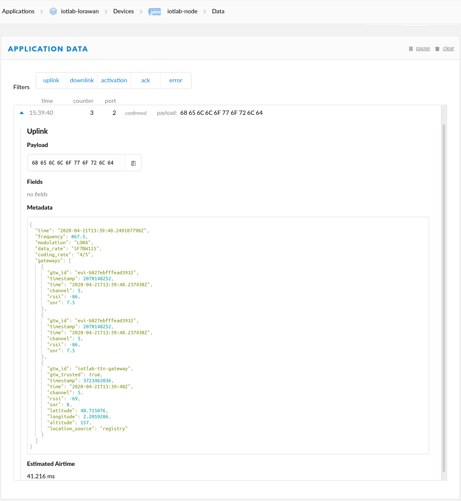

---
jupyter:
  jupytext:
    text_representation:
      extension: .md
      format_name: markdown
      format_version: '1.3'
      jupytext_version: 1.19.3
  kernelspec:
    display_name: Python 3 (ipykernel)
    language: python
    name: python3
---

## Advanced use of LoRaWAN with TheThingsNetwork

**Prerequisites:** You must have followed the [getting started with TTN notebook](../getting-started-ttn/getting-started-ttn.md) before starting this one.

> We also consider that the application id is **iotlab-lorawan** and the device id is **iotlab-node** but you'll have to use the ids corresponding to your application and device configured in TTN.

In this notebook, we propose to explore a little more the information exposed by the LoRaWAN network server when it receives a message from an end-device.

You will also try different LoRaWAN parameters on the end-device and observe their consequences on the messages received by the server:
- Send confirmed and unconfirmed messages
- Try the link check command on the device
- Test different datarate values
- The adaptive datarate configuration

### Start an experiment with one LoRa device

Like in the [getting started notebook](../ttn-getting-started/ttn-getting-started.md), you will book one of the LoRa device available in the IoT-LAB testbed.

1. Submit an experiment with one LoRa device on IoT-LAB:

```python
!iotlab-experiment submit -n "ttn-advanced" -d 120 -l 1,archi=st-lrwan1:sx1276+site=saclay
```

2. Wait for the experiment to be in the "Running" state:

```python
!iotlab-experiment wait --timeout 30 --cancel-on-timeout
```

> **Note:** If the command above returns the message `Timeout reached, cancelling experiment <exp_id>`, try to re-submit your experiment later.


### Build and flash the RIOT firmware

Like in the [getting started notebook](../ttn-getting-started/ttn-getting-started.md), you will build and flash the [tests/pkg_semtech-loramac RIOT application](https://github.com/RIOT-OS/RIOT/tree/master/tests/pkg_semtech-loramac). Using the RIOT shell, you will be able to configure several LoRaWAN parameters on the device and analyze the messages received on the TTN backend.

1. Build and flash the [tests/pkg_semtech-loramac RIOT application](https://github.com/RIOT-OS/RIOT/tree/master/tests/pkg_semtech-loramac) application of RIOT.

```python
!make IOTLAB_NODE=auto -C ../../RIOT/tests/pkg_semtech-loramac flash
```

2. Open a terminal: `File > New > Terminal` and connect to the shell by running the following command in the terminal:

<!-- #raw -->
make IOTLAB_NODE=auto -C riot/RIOT/tests/pkg_semtech-loramac term
<!-- #endraw -->

In the terminal, you can press *Enter* to get the `>` prompt from the RIOT shell.

### Configure the device and join the network

You will join the network using the OTAA activation method.

Before going through the next actions, open your [TTN console](https://console.thethingsnetwork.org/) in a browser and go to your device overview page.

1. Using the `loramac` shell command of RIOT, enter the device EUI, application EUI and application key:

<!-- #raw -->
> loramac set appeui 00000000000000
> loramac set deveui 00000000000000
> loramac set appkey 0000000000000000000000000000
<!-- #endraw -->

2. Change the datarate to 5:

<!-- #raw -->
> loramac set dr 5
<!-- #endraw -->

3. Now that the device is correctly configured for OTAA activation, it is time to join it to the network:

<!-- #raw -->
> loramac join otaa
Join procedure succeeded!
<!-- #endraw -->

<!-- #region -->
4. On TTN, you can already inspect the activation message that was received by the network server in the `Data` tab of your device console. You should have a line like this:
    
<figure style="text-align:center">
    <br/><br/>
    <figcaption><em>Activation message receiced on TTN</em></figcaption>
</figure>

On the web interface, each message received can be expanded: just click on the message line to get more information on the activation message:
    
<figure style="text-align:center">
    <br/><br/>
    <figcaption><em>Details of the activation message received on TTN</em></figcaption>
</figure>


See the [documentation about data format](https://www.thethingsindustries.com/docs/reference/data-formats/) for more details.

### Send some data with different parameters

1. Let's send a message to TTN from the RIOT shell:
<!-- #endregion -->

<!-- #raw -->
> loramac tx helloworld
Received ACK from network
Message sent with success
<!-- #endraw -->

In the `Data` tab of the device web console, 2 new lines are displayed:
    
<figure style="text-align:center">
    <br/><br/>
    <figcaption><em>Message received on TTN</em></figcaption>
</figure>

  - The first line is the confirmation message replied (an ACK) by the server to the device to tell him he correctly received the message. Also notice that the ACK is sent on port 0. In LoRaWAN, port 0 is reserved for the network layer which is managed between the server and the devices.
  - The second line is the message received by the server. By default, RIOT uses port 2.
  
You can click on the message received by the server to see some details:

<figure style="text-align:center">
    <br/><br/>
    <figcaption><em>Details of the message received on TTN</em></figcaption>
</figure>

What do we observe ?

- The payload of message is the string sent (`helloworld`) encoded in base64 and is available in the `frm_payload` field.
- The message went through several gateways. Compare their [RSSI](https://fr.wikipedia.org/wiki/Received_Signal_Strength_Indication) and [SNR](https://en.wikipedia.org/wiki/Signal-to-noise_ratio): the server will choose the gateway with the best RSSI/SNR to reply to the device.
- The Time on Air (or airtime) of the message was estimated to 41.216ms

TheThingsNetwork provide a very useful [airtime calculator](https://www.thethingsnetwork.org/airtime-calculator).

2. The `loramac tx` command can send unconfirmable messages when adding the `uncnf` parameter to the command line. Let's send an unconfirmable message:

<!-- #raw -->
> loramac tx helloworld uncnf
Message sent with success
<!-- #endraw -->

On the `Data` tab of the TTN console, you can observe that the server doesn't send an ACK downlink message anymore and RIOT doesn't notify either of a received ACK.

3. In RIOT, the `link_check` subcommand of the `loramac` shell command provides a way to get information about the link quality between the device and LoRaWAN gateways. The idea is to enable the link_check request, then send a message to the server, which will reply with the requested information:

<!-- #raw -->
> loramac link_check
Link check request scheduled
> loramac tx helloworld
Link check information:
  - Demodulation margin: 16
  - Number of gateways: 3
Received ACK from network
Message sent with success
<!-- #endraw -->

Here, since a confirmable message was sent, the server could reply the link information in the ACK reply.

The demodulation margin is related to the SNR and provide information about the best radio link quality between the device and the available gateways (3 here).

4. Change the datarate to a smaller value and send the same message again:

<!-- #raw -->
> loramac set dr 2
> loramac tx helloworld
<!-- #endraw -->

In the message details, you can observe that the datarate was changed. The SNR is also much better. The time on air also increased quite significantly. If you try to send the same message too fast, the loramac layer on the device will prevent the message sending because of the duty-cycle (`Cannot send: dutycycle restriction`). In this case, you just have to wait a bit to be able to send a message again.

5. In the IoT-LAB setup, all end-devices are very close to the gateway. The current configured datarate of 2 is too low for this spacial configuration. Let's enable the adaptive datarate on the device to let the server automatically request a datarate update on the device:

<!-- #raw -->
> loramac set adr on
> loramac tx helloworld
<!-- #endraw -->

In the TTN console, observe that the message was still sent with datarate 2. This is normal because at that moment the loramac stack on the device didn't noticed yet to the server its request to adapt its datarate.

And since we are sending confirmable message, the server could send the new datarate to apply in its ACK reply. So now, the new datarate should be used with future messages sent:

<!-- #raw -->
> loramac tx helloworld
<!-- #endraw -->

Again, you can confirm this in the new message received on the server, the new datarate should be back to 5, e.g. `SF7BW125`.

You can find some details about adaptive datarate in the [TTN documentation](https://www.thethingsnetwork.org/docs/lorawan/adaptive-data-rate.html).

### Free up the resources

Since you finished the training, stop your experiment to free up the experiment nodes:

```python
!iotlab-experiment stop
```

The serial link connection through SSH will be closed automatically.
