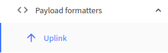
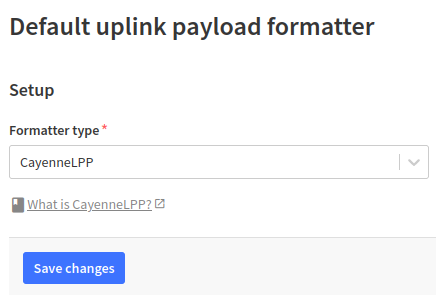

---
jupyter:
  jupytext:
    text_representation:
      extension: .md
      format_name: markdown
      format_version: '1.3'
      jupytext_version: 1.19.3
  kernelspec:
    display_name: Python 3 (ipykernel)
    language: python
    name: python3
---

##  Live plot of LoRaWAN payloads

### Introduction

In the [LoRaWAN getting-started Notebook](../getting-started/lorawan-getting-started.md), we learnt how to use LoRa boards available on IoT-LAB with [TheThingsNetwork LoRaWAN provider](https://www.thethingsnetwork.org/) (TTN). In [Use MQTT with TTN Notebook](../ttn-mqtt/ttn-mqtt.md), we sent/received messages to/from the TTN backend with MQTT. Let's now write our own Python script to receive the MQTT payloads and plot them as they arrive.

- The first step will be to implement the RIOT application. This is explained in the next section.
- The second step of this Notebook is to write a Python script, based on paho-mqtt to receive the payloads.
- And in the last step of this Notebook, you will use matplotlib to display the received values as they arrive.

### Write your RIOT application

To limit the size of the payload exchanged, we'll format them using **[Cayenne LPP](https://docs.mydevices.com/docs/lorawan/cayenne-lpp)**. This format is a binary format designed to reduce the payload size (remember that LoRaWAN has a very low datarate) while remaining quite flexible: the format encodes several channels that contain different kind of sendor data types (temperature, relative humidity, etc).

In the same directory as this notebook, you will find the 2 files of a basic RIOT application: `Makefile`, `main.c`. This application already contains code to read sensors, join a LoRaWAN and send a basic payload every 20s.

You can double click the files in the JupyterLab browser to open them in new tabs and start editing them.

As you can see, the application is already quite complete but the DEVEUI/APPEUI/APPKEY are empty (full of zeros) and the encoding to the Cayenne LPP format is missing in `main.c`. Fortunately, RIOT provides support for [a library for encoding to the Cayenne LPP](https://github.com/aabadie/cayenne-lpp). This is what will be used in this Notebook.

1. Change the DEVEUI, APPEUI, APPKEY default values (see C static arrays lines 23 to 35 in main.c). These values are available in your TTN device management page.

  **Note**: in the TTN device management page, you can switch the DEVEUI/APPEUI/APPKEY values from a plain hexadecimal string representation to a C array representation by clicking the `<>` button. Keep the _msb_ representation.
  
  **Important**: if you don't edit the deveui/appeui/appkey values, you device won't be able to join the network and send messages.

2. Add the missing Cayenne LPP header (under `/* TODO: Add the cayenne_lpp header */`):

```c
#include "cayenne_lpp.h"
```

3. Declare globally Cayenne LPP descriptor:

```c
static cayenne_lpp_t lpp;
```

4. In the sender function, prepare the cayenne lpp payload with the temperature and relative humidity values measured:

```c
cayenne_lpp_add_temperature(&lpp, 0, (float)temperature / 10);
cayenne_lpp_add_relative_humidity(&lpp, 1, (float)humidity / 10);
```

5. You have to replace the send of the dummy payload with the send of the cayenne lpp payload, e.g:

```c
uint8_t ret = semtech_loramac_send(&loramac, lpp.buffer, lpp.cursor);
```

instead of

```c
uint8_t ret = semtech_loramac_send(&loramac, (uint8_t *)message, strlen(message));
```

6. At the end of the while loop, you have to clear the cayenne lpp payload buffer between each send:

```c
cayenne_lpp_reset(&lpp);
```

7. You can now build the application:


```python
!make
```

### Experiment on IoT-LAB

1. Submit an experiment on IoT-LAB

```python
!iotlab-experiment submit -n "ttn-cayenne-lpp" -d 120 -l 1,archi=st-lrwan1:sx1276+site=saclay
```

2. Wait for the experiment to be in the "Running" state:

```python
!iotlab-experiment wait --timeout 30 --cancel-on-timeout
```

**Note:** If the command above returns the message `Timeout reached, cancelling experiment <exp_id>`, try to re-submit your experiment later.

3. Open a separate terminal in the menu`File > New > Terminal` and open a terminal on your LoRa device:

<!-- #raw -->
make IOTLAB_NODE=auto -C riot/lorawan/ttn-cayenne-lpp term
<!-- #endraw -->

4. Finally flash your new application on the LoRa device:

```python
!make IOTLAB_NODE=auto reset
```

In the terminal, you should see you device join the network with success and start sending payload to TTN.

In your TTN console, click the "Live data" tab of your devices where you should see the activation procedure and the uplink messages coming.

### Configure Cayenne LPP uplink payload format on TTN

1. In the device management console, select the "Uplink" option of the "Payload formatter" on the left:

<figure style="text-align:center">
    <br/><br/>
    <figcaption><em>Uplink payload formatter</em></figcaption>
</figure>

2. Select "Cayenne LPP" in the list of available payload formatter:

<figure style="text-align:center">
    <br/><br/>
    <figcaption><em>Cayenne LPP payload formatter</em></figcaption>
</figure>

### Write a Python script to receive the data over MQTT

Let's now write a Python script that will connect the TTN MQTT broker and subscribe to all uplink messages sent by our RIOT application. We'll use the [paho-mqtt](https://pypi.org/project/paho-mqtt/) Python package.

1. First, let's define the MQTT parameters required for TTN:

```python
TTN_MQTT_USERNAME = "Your AppId@ttn"  # Edit this line
TTN_MQTT_PASSWORD = "Your App API key" # Edit this line
TTN_MQTT_HOST = "eu1.cloud.thethings.network"
TTN_MQTT_PORT = 8883
TTN_MQTT_TOPIC = 'v3/+/devices/+/up'
```

2. For security reasons, we'll use TLS authentication to connect to TTN MQTT broker. Let's download a valid CA certificate:!wget https://letsencrypt.org/certs/isrgrootx1.pem

```python
!wget https://letsencrypt.org/certs/isrgrootx1.pem
```

3. Import paho-mqtt, create necessary callbacks and connect to the TTN broker. The MQTT message should now appear

```python
import paho.mqtt.client as mqtt


def on_ttn_message(client, userdata, msg):
    """Callback triggered for each message received from the server."""
    print("Message received on topic: {}".format(msg.topic))
    print(msg.payload)


def on_ttn_connect(client, userdata, flags, rc):
    """Callback triggered after the connection to the broker."""
    print('Connected to TTN broker, waiting for incoming messages')

    # Now that we are connected, we can subscribe to the device uplink topic.
    client.subscribe(TTN_MQTT_TOPIC)


def start_ttn(on_message_callback):
    """Create the client and connect it to the broker."""
    client = mqtt.Client()
    client.on_connect = on_ttn_connect
    client.on_message = on_message_callback
    client.tls_set("isrgrootx1.pem")
    client.username_pw_set(TTN_MQTT_USERNAME, TTN_MQTT_PASSWORD)
    client.connect(TTN_MQTT_HOST, TTN_MQTT_PORT, 60)
    return client


def run_client(on_message_callback):
    """Run the MQTT client in a an endless loop."""
    try:
        ttn_client = start_ttn(on_message_callback)
        ttn_client.loop_forever()
    except KeyboardInterrupt:
        print("Exiting")
    
run_client(on_ttn_message)
```

At this point, after a few time, you should see messages sent by the device poping up above. Click the ◼ button to stop the Python script above. This will stop the MQTT client.


4. Write the function to parse the incoming payload and extract the temperature and relative humidity measures. Adapt the TTN "on message" callback.

```python
import json

def parse_payload(payload):
    payload_json = json.loads(payload)
    measures = payload_json["uplink_message"]["decoded_payload"]
    temperature = measures["temperature_0"]
    relative_humidity = measures["relative_humidity_1"]
    return temperature, relative_humidity
    

def on_ttn_message_parse(client, userdata, msg):
    print("Message received on topic: {}".format(msg.topic))
    temperature, relative_humidity = parse_payload(msg.payload)
    print(f"Temperature: {temperature}°C, Relative humidity: {relative_humidity}%")
```

5. Run the MQTT client:

```python
run_client(on_ttn_message_parse)
```

Click the ◼ button to stop the MQTT client.

### Display the data received

To do this, you will use [matplotlib](https://matplotlib.org/stable/) a well known Python library used to display data.

1. First, create a figure with 2 subplots, one for the temperature measures and one for the relative humidity measures:

```python
import matplotlib.pyplot as plt
import numpy as np
import time

DATA_HISTORY = 50

# Prefill the displayed data with zeros
temperature_list = [0] * DATA_HISTORY
relative_humidity_list = [0] * DATA_HISTORY

%matplotlib widget

# Create the figure with 2 subplots
fig, axs = plt.subplots(2)

ax_temperature = axs[0]
ax_relative_humidity = axs[1]

# Configure the temperature subplot
ax_temperature.set_xlim([0, DATA_HISTORY - 1])
ax_temperature.set_ylim([-15, 50])
ax_temperature.set_title("Temperature (°C)")
ax_temperature.yaxis.set_label_position("right")
ax_temperature.yaxis.tick_right()
# plot the zero initialized temperatures
temperature_line, = ax_temperature.plot(temperature_list)

# Configure the relative humidity subplot
ax_relative_humidity.set_title("Relative humidity (%)")
ax_relative_humidity.set_xlim([0, DATA_HISTORY - 1])
ax_relative_humidity.set_ylim([0, 100])
ax_relative_humidity.yaxis.set_label_position("right")
ax_relative_humidity.yaxis.tick_right()
# plot the zero initialized relative humidity, in red
relative_humidity_line, = ax_relative_humidity.plot(relative_humidity_list, "r-")

# Make the plots nice
fig.tight_layout()
```

2. Write a new "on message" callbabk function that appends the incoming data to the corresponding list, set them to the plots and refresh the plots:

```python
def on_ttn_message_plot(client, userdata, msg):
    """Parse the received data and them to the plot."""
    print("Message received on topic: {}".format(msg.topic))
    # Parse the TTN payload
    temperature, relative_humidity = parse_payload(msg.payload)
    print(f"Temperature: {temperature}°C, Relative humidity: {relative_humidity}%")
    # Add data the global measures lists
    temperature_list.append(temperature)
    relative_humidity_list.append(relative_humidity)
    # Set the data to the corresponding lines
    temperature_line.set_ydata(temperature_list[-DATA_HISTORY:])
    relative_humidity_line.set_ydata(relative_humidity_list[-DATA_HISTORY:])
    # Refresh the drawing
    fig.canvas.draw() 


# Run the client endlessly (press the ◼ button to stop the MQTT client)
run_client(on_ttn_message_plot)
```

### Going further

Modify the RIOT application to add the `lps22hb` atmospheric pressure sensor values to the Cayenne LPP payload:
- You can have a look at the [online documentation of the driver](http://doc.riot-os.org/group__drivers__lpsxxx.html)
- You can have a look at the [test application code](https://github.com/RIOT-OS/RIOT/tree/master/tests/driver_lpsxxx) which provides driver API usage
- Note that the module is called `lps22hb`


### Free up the resources

Since you finished the training, stop your experiment to free up the experiment nodes:

```python
!iotlab-experiment stop
```

The serial link connection through SSH will be closed automatically.
