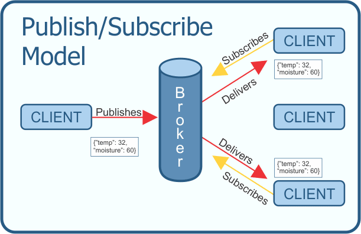

---
jupyter:
  jupytext:
    text_representation:
      extension: .md
      format_name: markdown
      format_version: '1.3'
      jupytext_version: 1.19.3
  kernelspec:
    display_name: Python 3 (ipykernel)
    language: python
    name: python3
---

## Use MQTT with TTN

**Prerequisites:** You must have followed at least the [getting started TTN notebook](../ttn-sensors/ttn-getting-started.md) before starting this one.

> We also consider that the application id is **iotlab-lorawan** and the device id is **iotlab-node** but you'll have to use the ids corresponding to your application and device configured in TTN.

In this notebook, you will continue the work done in the [getting started TTN notebook](../ttn-sensors/ttn-getting-started.md) and use the MQTT protocol to be able to receive locally the sensor values measured by the LoRa end-device. You will also adapt the RIOT application to be able to receive messages sent via MQTT.

More precisely, you will:
1. Configure the MQTT access to the TTN backend
2. Start an experiment on IoT-LAB with a LoRa device sending its sensor measures to TTN
3. Subscribe to the MQTT topic to receive in Jupyterlab the messages sent by the device
4. Extend the provided RIOT application (see the [Makefile](Makefile) and [main.c](main.c) files) to be able to receive messages sent from the LoRaWAN backend
5. Publish messages from Jupyterlab and verify they are received on the device

### A brief overview of MQTT

MQTT is a publish/subscribe messaging protocol designed for small sensors and mobile devices.

The MQTT protocol works with a central broker that handles topics to which clients can subscribe or publish to, the principle is illustrated in the following figure:

<figure style="text-align:center">
    <br/><br/>
    <figcaption><em>Publish/subscribe model of MQTT<br/>Source: <a href="https://www.researchgate.net/publication/327661439_The_Addition_of_Geolocation_to_Sensor_Networks">https://www.researchgate.net/publication/327661439_The_Addition_of_Geolocation_to_Sensor_Networks</a></em></figcaption>
</figure>

Let's say client `A` subscribes to the topic `/example/topic`, each message published by client `B` on the same topic will be received by `A`. Several clients can subscribe to the same topic and several clients can publish on the same topic.

The MQTT is very easy to put in place because it only requires one server, the MQTT broker which will handle the subcriptions and publications of all its clients.

The TTN backend provides an MQTT API in order to exchange messages with end-devices. Data access with via MQTT on TTN is documented [here](https://www.thethingsnetwork.org/docs/applications/mqtt/).

The TTN API defines MQTT topics to interact with the end-devices (replace `iotlab-node` with your device id and `iotlab-lorawan` with your application id:
- subscribe to the topic **+/devices/iotlab-node/up** to receive messages sent by the end-device
- publish on the topic **iotlab-lorawan/devices/iotlab-node/down** to send a message to the end-device


### Start an experiment on IoT-LAB

Now that we have a ready application, we can try it on the real hardware provided remotely by IoT-LAB.

1. Submit an experiment with one LoRa device on IoT-LAB:

```python
!iotlab-experiment submit -n "ttn-mqtt" -d 120 -l 1,archi=st-lrwan1:sx1276+site=saclay
```

2. Wait for the experiment to be in the "Running" state:

```python
!iotlab-experiment wait --timeout 30 --cancel-on-timeout
```

**Note:** If the command above returns the message `Timeout reached, cancelling experiment <exp_id>`, try to re-submit your experiment later.

3. Open a new terminal with the menu `File > New > Terminal` and in the terminal, run the following command to connect to the serial link of the LoRa board:

<!-- #raw -->
make IOTLAB_NODE=auto -C riot/lorawan/ttn-sensors term
<!-- #endraw -->

**Keep this command running until the end of this notebook.**

4. In the [main.c](main.c) file, configure the identifiers (application and device) and the application key. You can find them in the device overview on TTN. For the moment, they are provided with C array full of zeros :

```c
static const uint8_t appeui[LORAMAC_APPEUI_LEN] = { 0x00, 0x00, 0x00, 0x00, 0x00, 0x00, 0x00, 0x00 };
static const uint8_t deveui[LORAMAC_DEVEUI_LEN] = { 0x00, 0x00, 0x00, 0x00, 0x00, 0x00, 0x00, 0x00 };
static const uint8_t appkey[LORAMAC_APPKEY_LEN] = { 0x00, 0x00, 0x00, 0x00, 0x00, 0x00, 0x00, 0x00, 0x00, 0x00, 0x00, 0x00, 0x00, 0x00, 0x00, 0x00 };
```

**note:** in the device overview on TTN, it's possible to switch the representation of the EUIs and key from an hexadecimal representation (the default) to a C byte array representation (the one that interests us here): use the `<>` button to switch from one to the other and keep the MSB order.


5. Build and flash the application on the device:

```python
!make IOTLAB_NODE=auto flash
```

In the terminal, ensure the join procedure is successful and messages are sent every 30s. Also you can verify on the TTN console that the messages are correctly received.

### Use MQTT clients to receive messages for TTN

The [Eclipse Mosquitto project](https://mosquitto.org/) provides all the tools to use MQTT from a workstation. The [mosquitto-clients](https://packages.ubuntu.com/fr/bionic/mosquitto-clients) package contains command line tools to connect to the broker and to subscribe/publish on topics. These command line tools are already installed in jupyterlab.

The [TTN MQTT server page](https://www.thethingsindustries.com/docs/integrations/mqtt/) explains how to use the mosquitto-clients in order to connect them to the broker.

1. For security reasons, we will use the TLS authentication mode, so we first need to download the PEM encoded CA certificate file:

```python
!wget https://letsencrypt.org/certs/isrgrootx1.pem
```

2. Open another terminal with `File > New > Terminal` and run the following command there (we explain below what to use for `<AppId>` and `<AppKey>`):

<!-- #raw -->
mosquitto_sub -h eu1.cloud.thethings.network --cafile riot/lorawan/ttn-mqtt/isrgrootx1.pem -p 8883 -t 'v3/+/devices/+/up' -u '<AppId>@ttn' -P '<AppKey>' -v
<!-- #endraw -->

- `<AppId>` corresponds to your application name. So here we would use `iotlab-lorawan` but in your case, it's another name
- `<AppKey>` corresponds to your application key. Go to **Integrations>MQTT** tab in your application console and use **Generate new API key** button. Copy-paste the generated key.

If everything is correct the `mosquitto_sub` should print a json-like string each time a message is sent by the end-device:
```
v3/iotlab-lorawan@ttn/devices/iotlab-node/up {"end_device_ids":{"device_id":"iotlab-node","application_ids":{"application_id":"iotlab-lorawan"},"dev_eui":"xxxxxxxxxxxxxxxx","join_eui":"xxxxxxxxxxxxxxxx","dev_addr":"260BD493"},"received_at":"2021-06-03T13:08:58.624541Z","uplink_message":{"f_port":2,"f_cnt":78,"frm_payload":"SDogNDkuOCUsIFQ6MjcuM0M=",
...
```

If you look at the json content, the field `frm_payload` contains the message sent by the device. The message is encoded in [base64](https://en.wikipedia.org/wiki/Base64), but we can easily decode it using the `base64` module of Python (replace the value assigned to `payload_raw` with the values you get from `mosquitto_sub`:

```python
import base64
payload_raw = "SDogNDkuOCUsIFQ6MjcuM0M="

print(base64.b64decode(payload_raw))
```

<!-- #region -->
### Send messages to the end-device with MQTT

In order to send messages to the end-device with MQTT, we have to do two things:
- modify the RIOT application in order to add receiving capabilities
- use the `mosquitto_pub` client

The reception of LoRaWAN messages in RIOT is also described in the [Loramac package online documentation](http://doc.riot-os.org/group__pkg__semtech-loramac.html). In short, one need to add the `semtech_loramac_rx` module to the build and create a RIOT _thread_ to handle the received messages.

Thread usage in RIOT is documented online [here](http://doc.riot-os.org/group__core__thread.html).

1. Edit the [Makefile](Makefile) file and add the `semtech_loramac_rx` module (just under `USEMODULE = hts221`

```mk
USEMODULE += semtech_loramac_rx
```

2. Edit the [main.c](main.c) file with the following changes:

  a. Add the following block under the line 10:
  
  ```c
#include "thread.h"
#define RECV_MSG_QUEUE                   (4U)
static msg_t _recv_queue[RECV_MSG_QUEUE];
static char _recv_stack[THREAD_STACKSIZE_DEFAULT];
  ```

    This block includes the required API for managing RIOT thread as well as configuring the thread memory stack and a message queue, because communication with the loramac background thread is asynchronous.

  b. Between the keys and the `main` function, add the function running the reception thread:
  
  ```c
  static void *_recv(void *arg)
  {
      msg_init_queue(_recv_queue, RECV_MSG_QUEUE);
      (void)arg;
      while (1) {
          /* blocks until a message is received */
          semtech_loramac_recv(&loramac);
          loramac.rx_data.payload[loramac.rx_data.payload_len] = 0;
          printf("Data received: %s, port: %d\n",
                 (char *)loramac.rx_data.payload, loramac.rx_data.port);
      }
      return NULL;
  }
  ```
  
  For details, the `semtech_loramac_recv` function is described in the [loramac API page of the RIOT online documentation](http://doc.riot-os.org/semtech__loramac_8h.html).
  
  c. Now everything is in place to call the `thread_create` function that will start the thread in background. So in the `main` function, after the `Join procedure successful` message is printed and before the `while` loop, add the following:
  
  ```c
thread_create(_recv_stack, sizeof(_recv_stack),
              THREAD_PRIORITY_MAIN - 1, 0, _recv, NULL, "recv thread");
  ```
  

3. You can now build and flash the new version of the application:
<!-- #endregion -->

```python
!make IOTLAB_NODE=auto flash
```

In the terminal connected to serial port of the end-device, you see a successful join procedure, followed by messages containing the temperature and relative humidity.

4. To send messages with MQTT to the end-device, the final step is now to use the `mosquitto_pub`. Its usage is very similar to the `mosquitto_pub` client but, according to the [documentation](https://www.thethingsnetwork.org/docs/applications/mqtt/quick-start.html), the payload to send must also be previously encoded in base64 and the message be of the form `{"downlinks":[{"payload_frm":"<base64 payload>","f_port":<port number>, "priority":<priority_level>}]}`.

You can use the following cell to generate a payload in base64:

```python
import base64

payload = b"the message to send"

print(base64.b64encode(payload).decode())
```

Then run the following command in a terminal, use `File > New > Terminal` and replace `<AppName>`, `<DeviceId>` and `<AppKey>` with the values of your setup. You also have to replace `<payload>` with the payload encoded in base64:

<!-- #raw -->
mosquitto_pub -h eu1.cloud.thethings.network --cafile riot/lorawan/ttn-mqtt/isrgrootx1.pem -p 8883 -t 'v3/<AppName>@ttn/devices/<DeviceId>/down/push' -u '<AppName>@ttn' -P '<AppKey>' -m '{"downlinks":[{"f_port": 42,"frm_payload":"<payload>","priority": "NORMAL"}]}'
<!-- #endraw -->

In the terminal connected to serial port of the end-device, you should noticed that the message sent by MQTT is not received by the device immediately but only after a new message is sent by the device.

### Going further

If you want to go further with the MQTT usage, you can try to implement your own Python script by using the [paho-mqtt Python package](https://pypi.org/project/paho-mqtt/). You can also find good examples in the [paho-mqtt github repository](https://github.com/eclipse/paho.mqtt.python/tree/master/examples).

The paho-mqtt package is already installed in this notebook.

Using your own script, you can easily forward the data to a file, a database or a plot in this notebook.


### Free up the resources

Since you finished the training, stop your experiment to free up the experiment nodes:

```python
!iotlab-experiment stop
```

The serial link connection through SSH will be closed automatically.
