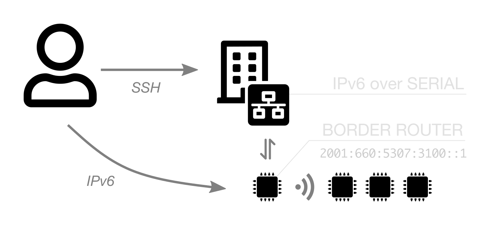

---
jupyter:
  jupytext:
    text_representation:
      extension: .md
      format_name: markdown
      format_version: '1.3'
      jupytext_version: 1.19.3
  kernelspec:
    display_name: Python 3 (ipykernel)
    language: python
    name: python3
---

<!-- #region -->
## Discover IPv6 and 6LoWPAN

In this exercice you will learn how you should communicate with IPV6 and wireless low power devices. The 6LoWPAN protocol has been developed to define the IPv6 adaptation and the way the IP datagrams will be transported over the IEEE802.15.4 radio links. You will deploy a private IPv6 network and test the connectivity between nodes. Moreover you will setup a public IPv6 network with a border router and verify that you can communicate with public servers. Finally with the monitoring feature you will configure a radio sniffer and analyse the traffic. With [Wireshark](https://en.wikipedia.org/wiki/Wireshark), a network packet analyzer, you will inspect the packets from the different protocols layers with headers and payloads.

### IPv6 overview

Before going into the explanations of network configuration on the nodes, it is essential to have some notions about IPv6. Unlike an IPv4 address which is coded on 32 bits (i.e. 4 bytes) and uses a decimal notation (for example: 192.168.6.19), an IPv6 address is represented by a series of 128 bits (16 bytes), and is represented with a hexadecimal notation.

For example, a public IPv6 address (so-called "global" unicast address, that is to say routable) on IoT-LAB Grenoble site can have the full representation:  
`2001:0660:5307:30ff:0000:0000:0000:0001`  
can be shortened to  
`2001:660:5307:30ff::1` (a series of 0 contiguous is replaced only once by ::).

This 128-bit series is often divided into 2 parts:

* the least significant 64 bits correspond to the address of the host, `::1` in the previous example. Generally, they are constructed from the MAC address of the host to guarantee the uniqueness of an IPv6 address in a subnet (since the physical address is itself unique, normally).

* the most significant 64 bits correspond to the network prefix, `2001:660:5307:30ff::/64` in the previous example. It's used for routing IPv6 packets and use, as in IPv4, the CIDR notation: &lt;prefix&gt; / &lt;bit length&gt;. This 64-bit block is divided into a first part containing up to 48 bits and designating the "global routing prefix",  (`2001:660:5307`) the rest of the bits identifying the subnet (`30ff`). A prefix always contains 64 bits.

Some prefixes are reserved for very specific uses:

* `fe80::/10` is used for unicast addresses called "link-local". This type of address only allows 2 network nodes to communicate if they share a direct physical link. This was the case with two nodes with wireless interface (802.15.4),

* `fd00::/8` is intended for "Unique Local Address" addresses. These addresses correspond to private addresses in IPv4 and are not routable.


### Submit an experiment on IoT-LAB
    
1. Choose your site (grenoble|lille|saclay|strasbourg):
<!-- #endregion -->

```python
%env SITE=grenoble
```

2. Submit an experiment with two nodes

```python
!iotlab-experiment submit -n "riot-ipv6" -d 60 -l 2,archi=m3:at86rf231+site=$SITE
```

3. Wait for the experiment to be in the Running state:

```python
!iotlab-experiment wait --timeout 30 --cancel-on-timeout
```

**Note:** If the command above returns the message `Timeout reached, cancelling experiment <exp_id>`, try to re-submit your experiment later or try on another site.


4. Check the nodes allocated to the experiment

```python
!iotlab-experiment --jmespath="items[*].network_address | sort(@)" get --nodes
```

#### Radio settings

If you are running this training at the same time as other people on the testbed, it is a good idea to change the default radio configuration to avoid too much collision with others.

Use the following cell to give you random values for channel and PAN ID.

```python
import os,binascii,random
pan_id = binascii.b2a_hex(os.urandom(2)).decode()
channel = random.randint(11, 26)
print('Use CHANNEL={}, PAN_ID=0x{}'.format(channel, pan_id))
```

Set environment variables for further use by modifying the values in the cell below with those obtained and run it:

```python
%env CHANNEL=11
%env PAN_ID=0xBEEF
```

### Communication between two nodes

Compile the RIOT `gnrc_networking` example:

```python
%env APP_DIR=../../RIOT/examples/gnrc_networking
!make -C $APP_DIR BOARD=iotlab-m3 DEFAULT_CHANNEL=$CHANNEL DEFAULT_PAN_ID=$PAN_ID
```

Then, flash the two nodes with this firmware:

```python
!iotlab-node --flash $APP_DIR/bin/iotlab-m3/gnrc_networking.bin
```

For each of the two experiment nodes open a Jupyter Terminal (use `File > New > Terminal`) and execute the following command to connect to its serial link, replacing `<site>` in the first command and `<id>`in the second with the right values:

<!-- #raw -->
ssh $IOTLAB_LOGIN@<site>.iot-lab.info
<login>@<site>:~$ nc m3-<id> 20000
<!-- #endraw -->

At this stage you can print the network configuration of one node and test the IPv6 connectivity with the other one. You can note that we use the "link-local" IPv6 address of the node (`inet6 addr` field). We don't have a global IPV6 address and we can only communicate because the two nodes are in the same radio neighborhood with the same physical link (802.15.4) and same channel.

<!-- #raw -->
> ifconfig
ifconfig
Iface  6  HWaddr: 11:15  Channel: 26  Page: 0  NID: 0x23
          Long HWaddr: 22:5C:FC:65:10:6B:11:15 
           TX-Power: 0dBm  State: IDLE  max. Retrans.: 3  CSMA Retries: 4 
          AUTOACK  ACK_REQ  CSMA  L2-PDU:102 MTU:1280  HL:64  RTR  
          6LO  IPHC  
          Source address length: 8
          Link type: wireless
          inet6 addr: fe80::205c:fc65:106b:1115  scope: link  VAL
<!-- #endraw -->

<!-- #raw -->
> ping fe80::205c:fc65:106b:1115
ping fe80::205c:fc65:106b:1115
12 bytes from fe80::205c:fc65:106b:1115: icmp_seq=0 ttl=64 rssi=-55 dBm time=7.951 ms
12 bytes from fe80::205c:fc65:106b:1115: icmp_seq=1 ttl=64 rssi=-55 dBm time=7.311 ms
12 bytes from fe80::205c:fc65:106b:1115: icmp_seq=2 ttl=64 rssi=-55 dBm time=9.231 ms

--- fe80::205c:fc65:106b:1115 PING statistics ---
3 packets transmitted, 3 packets received, 0% packet loss
round-trip min/avg/max = 7.311/8.164/9.231 ms
<!-- #endraw -->

### Communication via a Border Router (BR)

In order for a node to communicate in IPv6 with a host on the Internet, it needs a “global” unicast address. To do this, a Border Router node  must be added to the network, which will be responsible for propagating the IPv6 global prefix to the other nodes. We speak here of border router, because it is on the border between a 802.15.4 network and a classic Ethernet network. For this choose one node of your experiment to take the role of border router.

<figure>
    
    <figcaption><em>Public IPv6 connectivity on the IoT-LAB platform</em></figcaption>
</figure>

Compile and flash border router firmware to this node. Replace `<id>` with the right value:

```python
%env BR_ID = <id>
%env APP_DIR = ../../RIOT/examples/gnrc_border_router
!make -C $APP_DIR ETHOS_BAUDRATE=500000 BOARD=iotlab-m3 DEFAULT_CHANNEL=$CHANNEL DEFAULT_PAN_ID=$PAN_ID IOTLAB_NODE=m3-$BR_ID.$SITE.iot-lab.info flash
```

On the serial link of the coressponding node, you should seen the ouput correponding to the start of the border router firmware. Disconnect to the serial link of the BR node using `Ctrl+C` in this terminal, as it will be used for another purpose later. Keep the terminal open and connected to the SSH frontend to launch the commands of the following steps.


We need to create a network interface  on the SSH frontend choosing a public IPv6 prefix available. You can find below the list of public IPv6 prefix by sites:

| Site       | First Prefix        | Last Prefix         | Number of Prefix   |
|------------|---------------------|---------------------|--------------------|
| Grenoble   | 2001:660:5307:3100  | 2001:660:5307:317f  | 128                |
| Lille      | 2001:660:4403:0480  | 2001:660:4403:04ff  | 128                |
| Saclay     | 2001:660:3207:04c0  | 2001:660:3207:04ff  | 64                 |
| Strasbourg | 2a07:2e40:fffe:00e0 | 2a07:2e40:fffe:00ff | 32                 |

As it's a shared environment you must check before. Visualize which network interfaces are already used

<!-- #raw -->
<login>@<site>:~$ ip addr show | grep tap
313: tap0: <NO-CARRIER,BROADCAST,MULTICAST,UP> mtu 1500 qdisc pfifo_fast state DOWN group default qlen 1000
...
316: tap1: <NO-CARRIER,BROADCAST,MULTICAST,UP> mtu 1500 qdisc pfifo_fast state DOWN group default qlen 1000
...
582: tap8: <NO-CARRIER,BROADCAST,MULTICAST,UP> mtu 1500 qdisc pfifo_fast state DOWN group default qlen 1000
...
<!-- #endraw -->

In the example above you can see that we already have three interfaces in use (eg. tap0, tap1 and tap8). Take one from free by doing tap&lt;id&gt;+1 which gives tap9 here.

Visualize on the SSH frontend which prefix are already used:

<!-- #raw -->
<login>@<site>:~$ ip -6 route
2001:660:5307:3100::/64 via fe80::2 dev tap0 metric 1024 linkdown  pref medium
2001:660:5307:3102::/64 via fe80::2 dev tap2 metric 1024 linkdown  pref medium
2001:660:5307:3103::/64 via fe80::2 dev tap3 metric 1024 linkdown  pref medium
2001:660:5307:3104::/64 via fe80::2 dev tap4 metric 1024 linkdown  pref medium
2001:660:5307:3107::/64 via fe80::2 dev tap100 metric 1024 linkdown  pref medium
...
<!-- #endraw -->

In the example above you can choose the next one which is free on the Grenoble prefix list like 2001:660:5307:3108

Don't forget to close the serial port connection (i.e. nc command) with the BR node.

On the frontend SSH launch the ``ethos_uhcpd`` command with:
* a free tap ``<num>`` network interface
* a free ``<ipv6_prefix>`` on the good site. For example the first one of Grenoble site ``<ipv6_prefix>=2001:660:5307:3100``
* the good node's ``<id>`` for the border router

<!-- #raw -->
<login>@<site>:~$ sudo ethos_uhcpd.py m3-<id> tap<num> <ipv6_prefix>::/64
net.ipv6.conf.tap0.forwarding = 1
net.ipv6.conf.tap0.accept_ra = 0
Switch from 'root' to '<pseudo-iotlab>'
Switch from 'root' to '<pseudo-iotlab>'
Joining IPv6 multicast group...
entering loop...
----> ethos: sending hello.
----> ethos: activating serial pass through.
<!-- #endraw -->

This setup uses a single serial interface, ethos (Ethernet Over Serial) and UHCP (micro Host Configuration Protocol). Ethos multiplexes serial data to separate ethernet packets from shell commands. UHCP is in charge of configuring the wireless interface prefix and routes on the Border Router. Make sure to keep this terminal open until the end of the training.

Now on the other node shell with the `ifconfig` command you should see a global ipv6 address:

<!-- #raw -->
> ifconfig
ifconfig
Iface  6  HWaddr: 29:36  Channel: 26  Page: 0  NID: 0x23
          Long HWaddr: 15:11:6B:10:65:FB:A9:36 
           TX-Power: 0dBm  State: IDLE  max. Retrans.: 3  CSMA Retries: 4 
          AUTOACK  ACK_REQ  CSMA  L2-PDU:102 MTU:1280  HL:64  RTR  
          RTR_ADV  6LO  IPHC  
          Source address length: 8
          Link type: wireless
          inet6 addr: fe80::1711:6b10:65fb:a936  scope: local  VAL
          inet6 addr: 2001:660:5307:3100:1711:6b10:65fb:a936  scope: global  VAL
<!-- #endraw -->

When a node initializes a network interface and seeks to configure its IP, it performs a procedure called neighbor discovery defined by the Neighbor Discovery Protocol, NDP. First, it sends an ICMPv6 message of type "Router Solicitation" and if a router is present on the same link, this sends an ICMPv6 message of type "Router Advertisement" containing the prefix (these are also sent periodically through the router). In this way, the node automatically configures its global IP address with the prefix.

To test the node's IPv6 connectivity with internet, you could try to ping a public Google server:

<!-- #raw -->
> ping 2a00:1450:4007:80f::2003
ping 2a00:1450:4007:80f::2003
12 bytes from 2a00:1450:4007:80f::2003: icmp_seq=0 ttl=50 rssi=-46 dBm time=70.130 ms
12 bytes from 2a00:1450:4007:80f::2003: icmp_seq=1 ttl=50 rssi=-46 dBm time=68.492 ms
12 bytes from 2a00:1450:4007:80f::2003: icmp_seq=2 ttl=50 rssi=-46 dBm time=68.492 ms

--- 2a00:1450:4007:80f::2003 PING statistics ---
3 packets transmitted, 3 packets received, 0% packet loss
round-trip min/avg/max = 68.492/69.038/70.130 ms
<!-- #endraw -->

### Radio sniffer

One of the key feature of IoT-LAB is the automatic monitoring on energy consumption and radio activity, thanks to a Control Node, associated to the experiment node. You do not have to bring a firmware for this Control Node, but just specify its configuration through what we call a 'profile'. Each user can manage his collection of profiles. Here you will create one.

Run the command to create a sniffer profile on the radio channel used here:

```python
!iotlab-profile addm3 -n sniff -sniffer -channels $CHANNEL
```

Then, you just have to update the profile configuration of your node which is not the BR. We use the `-e` option here, that means 'for all nodes of the experiment expected the one specified'.

```python
!iotlab-node --update-profile sniff -e $SITE,m3,$BR_ID
```

Open a third Jupyter Terminal (use `File > New > Terminal`) and connect to the SSH frontend replacing `<site>` with the good value:

<!-- #raw -->
ssh $IOTLAB_LOGIN@<site>.iot-lab.info
<!-- #endraw -->

From the SSH frontend launch the `sniffer_aggregator` command. This tool aggregates all the nodes sniffer links (TCP socket on port 30000). By default, it encapsulates packet as ZigBee Encapsulation Protocol (ZEP). With the -r option 802.15.4 payloads are extracted and saved in a 802.15.4_link_layer pcap file directly usable in [Wireshark](https://en.wikipedia.org/wiki/Wireshark), a network packet analyser.

<!-- #raw -->
<login>@<site>:~$ sniffer_aggregator -r -d -o - | tshark -V -i - > sniffer.pcap
<!-- #endraw -->

Now, go to the RIOT shell node and ping6 Google server (only once with option -c 1)

<!-- #raw -->
> ping6 -c 1 2a00:1450:4007:80f::2003
ping6 -c 1 2a00:1450:4007:80f::2003
12 bytes from 2a00:1450:4007:80f::2003: icmp_seq=0 ttl=50 rssi=-58 dBm time=65.511 ms

--- 2a00:1450:4007:80f::2003 PING statistics ---
1 packets transmitted, 1 packets received, 0% packet loss
round-trip min/avg/max = 65.511/65.511/65.511 ms
<!-- #endraw -->

On the sniffer aggregator output you should see that you have captured packets. Stop it with `Ctr+C` shortcut when you have at least 6 packets captured.

Display the pcap file and analyse the traffic:

<!-- #raw -->
<login>@<site>:~$ less sniffer.pcap  
# use Q character shortcut to exit
<!-- #endraw -->

From the frame1 (first packet) you can see the IEEE 802.15.4 data, 6LoWPAN and Internet Protocol version 6 layer.

* In the 802.15.4 section you can see the MAC address of the source and destination packet. You can retrieve the MAC address of your node which executes the ping6 address in the Src field.

* In the 6LoWPAN section you can see the IPV6 address of the source and destination packet.

* In the IPv6 section you can see the ICMP message which corresponds to a Echo ping request (ping6 command)

From the frame2 you should see the ICMP message from the Google server which corresponds to Echo ping reply.

In the next frames you can discover the Neighbor Discovery Protocol traffic between the border router and the node. You should see Neighbor Solicitation and Advertisement message exchanged  between the border router and the node.


### Free up the resources

Since you finished the training, stop your experiment to free up the experiment nodes:

```python
!iotlab-experiment stop
```

The serial link connection through SSH and the ethos process will be closed automatically.
