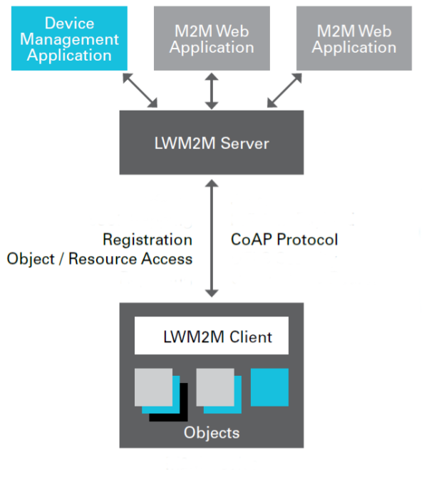
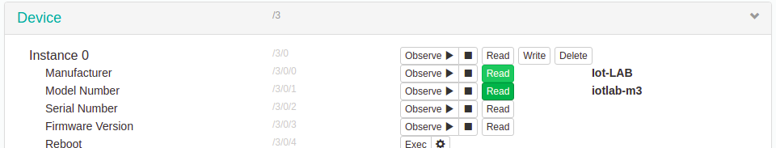
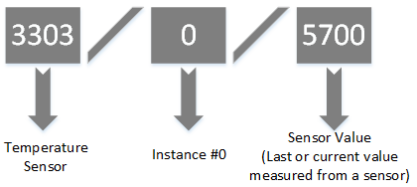
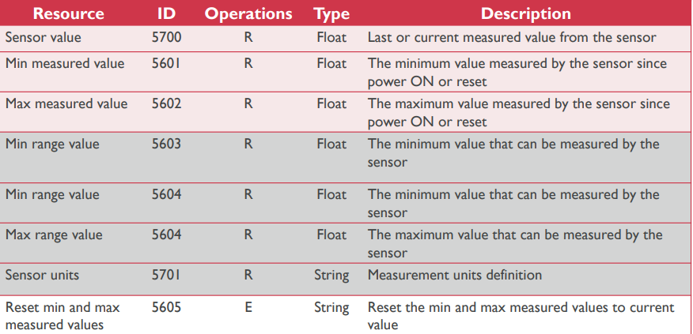
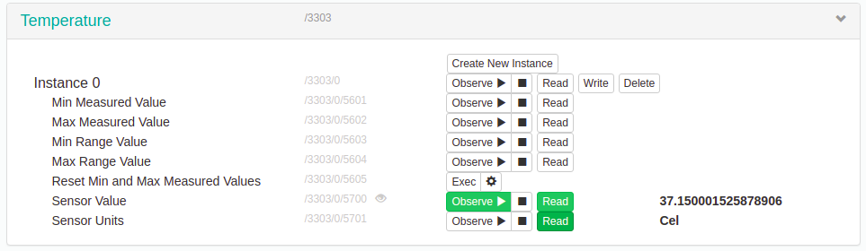

---
jupyter:
  jupytext:
    text_representation:
      extension: .md
      format_name: markdown
      format_version: '1.3'
      jupytext_version: 1.19.3
  kernelspec:
    display_name: Python 3 (ipykernel)
    language: python
    name: python3
---

## Discover LwM2M protocol

In this excercice we will use the RIOT LwM2M wakaama client implementation. Lightweight M2M is a communication protocol from the Open Mobile Alliance built to provide a link between a device equipped with a LwM2M client and LwM2M-enabled servers. LwM2M protocol lets users remotely perform tasks, run application and device management on their IoT embedded devices. The LWM2M protocol stack is based on CoAP.

You will learn how to deploy a public IPv6 network with IoT-LAB M3 nodes and register a RIOT LwM2M client to the IoT-LAB Leshan server (java implementation of LwM2M server). Moreover you will discover the resource model of LwM2M.  Each piece of information made available by the LWM2M Client is a Resource. The Resources are further logically organized into Objects. Thus you will define a temperature object and the associated resource based on the LPS331ap sensor.

<figure style="text-align:center">
    <br/><br/>
    <figcaption><em>LwM2M architecture</em></figcaption>
</figure>


#### Radio settings

If you are running this training as the same time as other people, it is a good idea to change the default radio configuration to avoid too much collision with others.

Use the following cell to give you random values for channel and PAN ID.

```python
import os,binascii,random
pan_id = binascii.b2a_hex(os.urandom(2)).decode()
channel = random.randint(11, 26)
print('Use CHANNEL={}, PAN_ID=0x{}'.format(channel, pan_id))
```

For these values to be taken into account you can set an environment variable for the notebook. Modify the values in the cell below with those obtained and execute it.

```python
%env CHANNEL=11
```

```python
%env PAN_ID=0xBEEF
```

### Submit an experiment on IoT-LAB

1. Choose your site (grenoble|lille|saclay|strasbourg):

```python
%env SITE=grenoble
```

2. Submit an experiment with two nodes

```python
!iotlab-experiment submit -n "riot-lwm2m" -d 120 -l 2,archi=m3:at86rf231+site=$SITE
```

3. Wait for the experiment to be in the Running state:

```python
!iotlab-experiment wait --timeout 30 --cancel-on-timeout
```

**Note:** If the command above returns the message `Timeout reached, cancelling experiment <exp_id>`, try to re-submit your experiment later or try on another site.


4. Check the nodes allocated to the experiment

```python
!iotlab-experiment --jmespath="items[*].network_address | sort(@)" get --nodes
```

### Deploy public IPv6 network

1. Compile the RIOT gnrc_border router example

A border router (BR) is a routing device to connect a wireless sensor network to the Internet based on IPv6 technology. Choose one node of your experiment which play the role of BR. Compile and flash BR firmware to this node. Replace `<id>` with the right value:

```python
%env BR_ID = <id>
%env APP_DIR = ../../RIOT/examples/networking/gnrc/border_router
!make -C $APP_DIR ETHOS_BAUDRATE=500000 BOARD=iotlab-m3 DEFAULT_CHANNEL=$CHANNEL DEFAULT_PAN_ID=$PAN_ID
```

```python
!iotlab-node --flash $APP_DIR/bin/iotlab-m3/gnrc_border_router.bin -l $SITE,m3,$BR_ID
```

3. Connect the Border Router to the IPv6 internet

Open a Jupyter terminal (use `File > New > Terminal`)

Connect to the IoT-LAB SSH frontend and replace ``<site>`` with the good value

<!-- #raw -->
ssh $IOTLAB_LOGIN@<site>.iot-lab.info
<!-- #endraw -->

From the SSH frontend launch ethos_uhcpd.py command with the good parameters. Don't forget to check before if the tap interface and the ipv6 prefix are available. Replace `<id>` with the BR node id.


| Site       | First Prefix        | Last Prefix         | Number of Prefix   |
|------------|---------------------|---------------------|--------------------|
| Grenoble   | 2001:660:5307:3100  | 2001:660:5307:317f  | 128                |
| Lille      | 2001:660:4403:0480  | 2001:660:4403:04ff  | 128                |
| Saclay     | 2001:660:3207:04c0  | 2001:660:3207:04ff  | 64                 |
| Strasbourg | 2a07:2e40:fffe:00e0 | 2a07:2e40:fffe:00ff | 32                 |


<!-- #raw -->
<login>@<site>:~$ ip addr show | grep tap
<!-- #endraw -->

<!-- #raw -->
<login>@<site>:~$ ip -6 route
<!-- #endraw -->

<!-- #raw -->
<login>@<site>:~$ sudo ethos_uhcpd.py m3-<id> tap<num> <public_ipv6_prefix>::1/64
<!-- #endraw -->

```
net.ipv6.conf.tap5.forwarding = 1
net.ipv6.conf.tap5.accept_ra = 0
Switch from 'root' to 'user'
Switch from 'root' to 'user'
Joining IPv6 multicast group...
entering loop...
----> ethos: sending hello.
----> ethos: activating serial pass through.
----> ethos: hello reply received
```

Make sure to let this terminal open until the end of the training.

### Register a LwM2M client

You can visualize the LwM2M clients which have already been registered on the [IoT-LAB Leshan server](http://leshan.iot-lab.info/#/clients). 


Open a Jupyter terminal (use `File > New > Terminal`) and compile the LwM2M client firmware with good parameters

* SERVER_ADDR is the public IPv6 address of the IoT-LAB Leshan server.
* DEVICE_NAME is the client name 

Replace `<id> <site>` with the good value for LwM2M client node. Replace `<channel> <pan_id>` by the values you obtained in the `Radio settings` section.

<!-- #raw -->
make -C riot/networking/lwm2m SERVER_ADDR=2001:660:5307:3200::2 DEVICE_NAME=m3-<id> DEFAULT_CHANNEL=<channel> DEFAULT_PAN_ID=<pan_id> IOTLAB_NODE=m3-<id>.<site>.iot-lab.info flash term
<!-- #endraw -->

At this stage you can print the help of the shell and test the IPv6 connectivity with the Leshan server

<!-- #raw -->
> help
help
Command              Description
---------------------------------------
lwm2m                Start LwM2M client
reboot               Reboot the node
ps                   Prints information about running threads.
ping6                Ping via ICMPv6
random_init          initializes the PRNG
random_get           returns 32 bit of pseudo randomness
nib                  Configure neighbor information base
ifconfig             Configure network interfaces
> ping 2001:660:5307:3200::2
ping 2001:660:5307:3200::2
12 bytes from 2001:660:5307:3200::2: icmp_seq=0 ttl=59 rssi=-46 dBm time=51.322 ms
12 bytes from 2001:660:5307:3200::2: icmp_seq=1 ttl=59 rssi=-46 dBm time=56.959 ms
12 bytes from 2001:660:5307:3200::2: icmp_seq=2 ttl=59 rssi=-46 dBm time=57.563 ms

--- 2001:660:5307:3200::2 PING statistics ---
3 packets transmitted, 3 packets received, 0% packet loss
round-trip min/avg/max = 51.322/55.281/57.563 ms
<!-- #endraw -->

Now start the LwM2M client registration

<!-- #raw -->
> lwm2m help
lwm2m help
usage: lwm2m <start|mem>
> lwm2m start
lwm2m start
<!-- #endraw -->

<!-- #region -->
Go to the [IoT-LAB Leshan server interface](http://leshan.iot-lab.info/#/clients) and verify that your client have been registered. Select the client in the list and in the tab `Device` read `Manufacturer` and `Model Number` attributes. View in the Makefile how the device manufacturer is set up. 

You should also see that the object id of the device is `/3`. You can find more details with [LwM2M Object and Resource Registry](http://www.openmobilealliance.org/wp/OMNA/LwM2M/LwM2MRegistry.html)

<figure style="text-align:center">
    <br/><br/>
    <figcaption><em>LwM2M device</em></figcaption>
</figure>


### Add a temperature object


LwM2M objects are accessible with simple URI(s): /{object_id}/{object_instance}/{resource_id}. For example with temperature object if you want to get the sensor value that gives

<figure style="text-align:center">
    <br/><br/>
    <figcaption><em>Temperature object URI</em></figcaption>
</figure>


You can consult the [temperature object XML](http://www.openmobilealliance.org/tech/profiles/lwm2m/3303.xml) definition here and view a summary in the the table below:

<figure style="text-align:center">
    <br/><br/>
    <figcaption><em>Temperature object</em></figcaption>
</figure>


#### Manage the initialization of the LPS331ap sensor

* Add the lps331ap module driver into the [Makefile](Makefile)

```mk
USEMODULE += lps331ap
```

* Edit the [lwm2m_cli.c](lwm2m_cli.c) file and include the sensor drivers

```c
#include "lpsxxx.h"
#include "lpsxxx_params.h"
```

* Add a sensor variable 
   
```c
static lpsxxx_t sensor;
```
    
* Initialize the driver in the **lwm2m_cli_cmd** function

```c
            if (lpsxxx_init(&sensor, &lpsxxx_params[0]) != LPSXXX_OK) {
                puts("LPS331AP initialization failed");
                return 1;
            }
            lpsxxx_enable(&sensor);
```

#### Add a LwM2M temperature object

* Include temperature object headers

```c
#include "temperature_object.h"
```

* Increment the number of LwM2M objects (4 instead of 3)

```c
#define OBJ_COUNT (4)
```

* Declare an object instance

```c
static lwm2m_temp_instance_t *temp_instance;
```

* Create temperature object in the **lwm2m_cli_init** function

```c
    obj_list[3] = lwm2m_client_get_temperature_object();
```

* Get the instance in the **lwm2m_cli_cmd** function

```c
            temp_instance = (lwm2m_temp_instance_t *)
                             lwm2m_list_find(obj_list[3]->instanceList, 0);
```

#### Create temperature sensor reader thread

The value of the sensor is read with a static interval.  

* Define the reader interval

```c
#define TEMP_READ_INTERVAL (5 * MS_PER_SEC)
```

* Define thread priority

```c
#define TEMP_PRIO  (THREAD_PRIORITY_MAIN - 6)
```

* declare thread stack size

```c
static char thread_stack[THREAD_STACKSIZE_MAIN];
```

*  Create thread in **lwm2m_cli_cmd** function

```c
            thread_create(thread_stack, sizeof(thread_stack),
                          TEMP_PRIO, 0,
                          _temp_read_thread, NULL, "temp_reader");
```

* Add the thread that reads the sensor

This thread reads the sensor value, updates the LwM2M object instance sensor value and notifies observers that the value has changed.

```c
static void *_temp_read_thread(void *arg)
{
    (void)arg;
    int16_t temp;
    lwm2m_uri_t uri;
    LWM2M_URI_RESET(&uri);
    uri.objectId = LWM2M_TEMP_OBJECT_ID;
    uri.instanceId = temp_instance->shortID;
    uri.resourceId = LWM2M_TEMP_RES_SENSOR_VALUE;
    while (1) {
        lpsxxx_read_temp(&sensor, &temp);
        temp_instance->sensor_value = temp / 100.0;
        /* mark changed for observers */
        lwm2m_resource_value_changed(client_data.lwm2m_ctx, &uri);
        ztimer_sleep(ZTIMER_MSEC, TEMP_READ_INTERVAL);
    }
    return 0;
}
```

#### Recompile and flash the LwM2M client firmware

Use the previous terminal and disconnect to the serial link of the LwM2M node using `Ctrl+C`. After relaunch the make command.
<!-- #endregion -->

<!-- #raw -->
make -C riot/networking/lwm2m SERVER_ADDR=2001:660:5307:3200::2 DEVICE_NAME=m3-<id> DEFAULT_CHANNEL=<channel> DEFAULT_PAN_ID=<pan_id> IOTLAB_NODE=m3-<id>.<site>.iot-lab.info flash term
<!-- #endraw -->

Restart the LwM2M client registration

<!-- #raw -->
> lwm2m start
lwm2m start
<!-- #endraw -->

Now on the Leshan server below the device object you can see a new temperature object with the id 3303.
Read the `Sensor units` and `Sensor value`. After you should `Observe` the `Sensor value` and verify that the value is updated automatically each five seconds. Indeed the Leshan server is a CoAP observer of the sensor value resource and it will be notified by the LwM2M client in the read sensor method when the value has changed.

<figure style="text-align:center">
    <br/><br/>
    <figcaption><em>LwM2M temperature object</em></figcaption>
</figure>


### Free up the resources

Since you finished the training, stop your experiment to free up the experiment nodes:

```python
!iotlab-experiment stop
```

The serial link connection through SSH and the ethos process will be closed automatically
