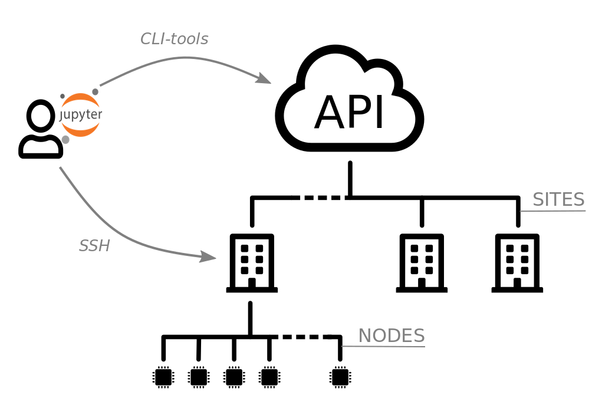

---
jupyter:
  jupytext:
    text_representation:
      extension: .md
      format_name: markdown
      format_version: '1.3'
      jupytext_version: 1.19.3
  kernelspec:
    display_name: Python 3 (ipykernel)
    language: python
    name: python3
---

# Welcome to the first activity of the MOOC

All the hands-on activities of this MOOC will take place in JupyterLab, a web-based interactive development environment for Jupyter notebooks. If you are unfamiliar with this environment or this is the first time you are going to use Jupyter notebooks we strongly encourage you to read this [introduction](./start.md).

This activity will allow you to discover the infrastructure of the IoT-LAB testbed and give you information about access, how you can interact with it. This is not a hands-on activity where you will start a testbed experiment, but rather a list of pre-requisites that will be useful for the whole Mooc suite. Be patient, you will be programming an IoT object in the next activities.

## IoT-LAB testbed infrastructure

The figure below gives you a schematic overview of the infrastructure.

<figure>
    
    <figcaption><em>IoT-LAB testbed infrastructure</em></figcaption>
</figure>

Here is some explanation of the different elements.

<ul class="fa-ul">
    <li><span class="fa-li"><i class="fas fa-user"></i></span>the <strong>Mooc participant</strong> who interacts with the testbed from Jupyter notebooks</li>
<li><span class="fa-li"><i class="fas fa-cloud"></i></span> The central access point of testbed is its open <strong>REST API</strong>, managing user requests like experiment submission, and dispatching orders over the different sites.
<li><span class="fa-li"><i class="fas fa-building"></i></span> On each <strong>site</strong>, a server accessible via SSH (known as <strong>SSH frontend</strong>) offers access to a development environment, as well as collected data, serial link access, debug interface and radio sniffing interface of boards.</li>
<li><span class="fa-li"><i class="fas fa-microchip"></i></span> Each site hosts a number of boards, also called experimenation <strong>nodes</strong></li>
</ul>


## Your IoT-LAB access

The IoT-LAB testbed will be used to run embedded code on electronic boards. No need to create an account on the testbed, everything has be done and setup for you in your JupyterLab environment.

### Account Login

As your IoT-LAB user login is not so easy to remember, it is stored in an environment variable, that can be used in a notebook cell or in a Terminal. Let's see it's content:

```python
!echo $IOTLAB_LOGIN
```

### Connection to SSH frontend

Some commands or tools need to be run from the SSH frontends. To connect to it, an SSH key pair has been generated for you and associated to your account.

Let's verify the setup.

1. Open a new JupyterLab Terminal (use `File > New > Terminal`)
2. Connect to the Lyon's server site running the following command in the JupyterLab Terminal:

<!-- #raw -->
ssh $IOTLAB_LOGIN@lyon.iot-lab.info
<!-- #endraw -->

3. Then, execute the `ls` command which displays files and directories of your home directory on the SSH frontend:

<!-- #raw -->
<login>@lyon:~$ ls
<!-- #endraw -->

### CLI Tools
IoT-LAB CLI command-line tools, used in Jupyter notebooks, request REST API to interact with your experiments on the testbed. All requests require your IoT-LAB credentials. To avoid having to specify them each time, it could be recorded. Of course, we have already did it for you.

Verify the setup by executing the following cell, which prints status of the resources on the Lyon site:

```python
!iotlab-status --nodes-ids --site lyon
```

<!-- #region -->
## Experiment resources availability

The previous command gives you the availability of resources for a site, sorted by architecture (ie. board type). In the MOOC activities, you will only use the IoT-LAB M3 board (aka 'm3:at86rf231'). Free resources are the one with the state 'Alive'. They are listed by ids, '-' specifying a range, and '+' a concatenation. The entry "1-6+8-11" corresponds with the list of nodes: 1, 2, 3, 4, 5, 6, 8, 9, 10 and 11.

You are a large number of users to have registered for the Mooc, who will use the testbed and share it with its regular users. 
Thus, to best share its resources, and according to the needs of activities, we set some rules applied to users of the MOOC:

* only one experiment at a time
* a maximum of three nodes per experiment
* a maximum duration of 2 hours per experiment

We have a limited number of experiment resources available, which corresponds to more than 300 simultaneous experiments. So, despite these rules, it could happen that no more resources are available on a site and your experiment is scheduled later.

That's why we use options with the `wait` subcommand:

```bash
iotlab-experiment wait --timeout 30 --cancel-on-timeout
```

`--timeout` specifies a maximum waiting duration (in seconds)  
`--cancel-on-timeout` cancels the experiment if the timeout is reached

Then, if the `Timeout reached, cancelling experiment <exp_id>` message appears, you should choose another site for the `SITE` environment variable:

```bash
%env SITE=lille
```

and re-submit the experiment.

At the end of each notebook, you'll find a last command that permits to stop your experiment::

```bash
!iotlab-experiment stop
```

Don't forget to run it to free the resources used and make them available for others.
<!-- #endregion -->

## Restoring an exercise

It is possible to restore an exercise completely in its original state.

To restore an exercise, just **add a code cell** in the corresponding exercise notebook with the following command:

<!-- #raw -->
!git checkout .
<!-- #endraw -->

Then close and reopen all tabs corresponding to the exercise.

**Warning:** all your previous work on the exercise - code changes, notebook output - will be lost with this command. Be careful!


---

# Ready!
If everything is fine, you have all the tooling needed for the following hands-on activities.  
You reached the end of this first activity, the next one will be in Module 2.
