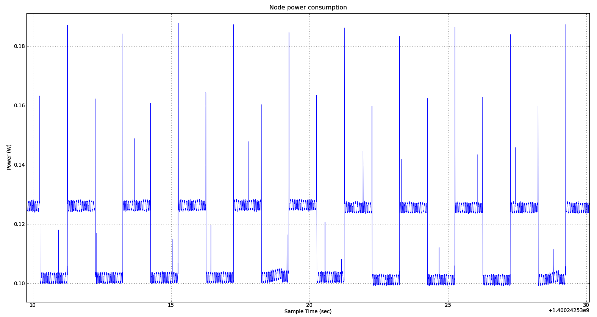

---
jupyter:
  jupytext:
    text_representation:
      extension: .md
      format_name: markdown
      format_version: '1.3'
      jupytext_version: 1.19.3
  kernelspec:
    display_name: Python 3 (ipykernel)
    language: python
    name: python3
---

## Consumption monitoring

Consumption monitoring is an optional feature which measures the energy usage of your experiment nodes. It refers to the Control Node dedicated hardware installed on the IoT-LAB node to enable the monitoring. In this documentation you will learn how to create a Profile monitoring configuration and enable it for your experiment. Moreover you will figure out how to get and analyse the monitoring data.


### Monitoring profile

You must create a monitoring profile with the following configuration

* Monitor consumption: current, voltage and power.
* Period: 8244 µs
* Average: 4

These settings will give you a sampling period of P = 8.244 ms * 4 * 2 = 65.95 ms. You can see additional informations about sampling at the end of this tutorial

```python
!iotlab-profile addm3 -n consumption -voltage -current -power -period 8244 -avg 4
```

### Launch an experiment

1. Choose your site (grenoble|lille|strasbourg):

```python
%env SITE=grenoble
```

2. Submit an experiment with two nodes, the monitoring profile and a prebuilt tutorial firmware. This firmware flashing LED(s) with a frequency of 1Hz. 

```python
!iotlab-experiment submit -n "consumption" -d 5 -l 2,archi=m3:at86rf231+site=$SITE,tutorial_m3.elf,consumption
```


3. Wait for the experiment to be in the Running state:

```python
!iotlab-experiment wait --timeout 30 --cancel-on-timeout
```

**Note:** If the command above returns the message `Timeout reached, cancelling experiment <exp_id>`, try to re-submit your experiment later or try on another site.

4. Check the nodes allocated to the experiment

```python
!iotlab-experiment --jmespath="items[*].network_address | sort(@)" get --nodes
```

### Analyse monitoring data

The monitoring data is stored on the SSH frontend server in your home directory. You can find it in the `~/.iot-lab/<exp_id>/consumption/` directory. We use the OML measurement library and you can find a file ``m3_<id>.oml`` for each monitored nodes. Don’t worry if you have empty files, OML library performs caching.

**You have to wait a little and manually stop the experiment to flush the cache.**

```python
!iotlab-experiment stop
```

Let's retrieve an OML file from the IoT-LAB SSH frontend. Replace `<id>` with the identifier of one the nodes in the previous experiment (`.iot-lab/last` is a symlink to your last experiment directory `.iot-lab/<exp_id>`):

```python
%env NODE_ID=<id>
!scp -o StrictHostKeyChecking=no $IOTLAB_LOGIN@$SITE.iot-lab.info:~/.iot-lab/last/consumption/m3_$NODE_ID.oml consumption.oml
```

Print the beginning of the monitoring OML file content:

```python
!head -n 20 consumption.oml
```

You can see the last three columns of the file which correspond respectively to the power, voltage and current measurements.

We provide an OML plotting tool which helps you to analyse monitoring data.


```python
%matplotlib widget
from oml_plot_tools import consum
data = consum.oml_load('consumption.oml')
data = data[0:300]
consum.consumption_plot(data, 'consumption', ('power'))
```

You may observe oscillations corresponding to the 1Hz LED(s) flashing. It is also possible to measure the current on each LED which is theoretically equal to 2.4 mA.

A zoom of the previous plot to see the one second period.

```python
%matplotlib widget
from oml_plot_tools import consum
data = consum.oml_load('consumption.oml')
data = data[0:100]
consum.consumption_plot(data, 'consumption', ('power'))
```

We join you an example of plot with a smaller sample period (``2.200 ms = Period 1100 µs * Average 1 * 2``). You can observe that the signal measure noise is not filtered.



<!-- #region -->
### Additional informations

The consumption of your node is measured through an INA226 hardware component . The INA226 has programmable conversion times for two measurements, the shunt voltage and the power supply bus voltage. The conversion times (CT) for these measurements can be selected from as fast as 140μs to as long as 8.244ms. The conversion time settings, along with the programmable averaging mode (AV), allow the INA226 to be configured to optimize the available timing requirements in a given application. The periodic measure (PM) is then given by the formula:

``PM = CT * AV * 2``

There are trade-offs associated with the settings for conversion time and the averaging mode used. The averaging feature can significantly improve the measurement accuracy by effectively filtering the signal. A greater number of averages enables the INA226 to be more effective in reducing the noise component of the measurement.

For example, if a system requires that data be read every 4ms, the INA226 could be configured for a non filtered signal with the conversion times set to 2116 μs and the averaging mode set to 1. This configuration results in the data updating approximately every 4.23 ms = 2.116*1*2

With a configuration for a filtered signal, the conversion times can be set to 204 μs and the averaging mode can be set to 10 in order to have a periodic measure of 4.08 ms = 204*10*2


| Measure | Unit   |
|---------|--------|
| Current | ampere |
| Voltage | volt   | 
| Power   | watt   | 

<!-- #endregion -->
